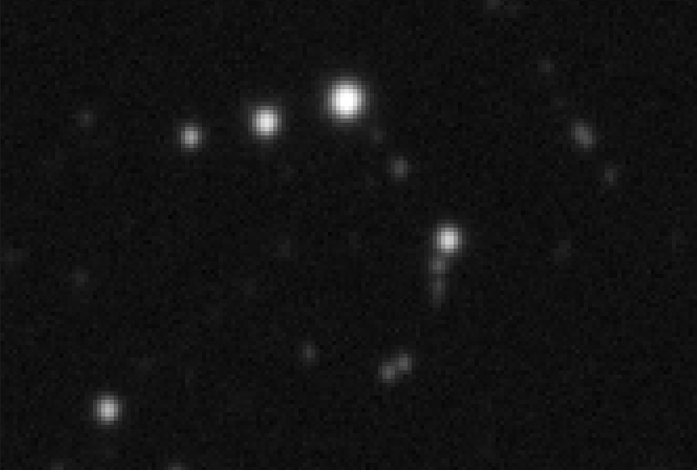
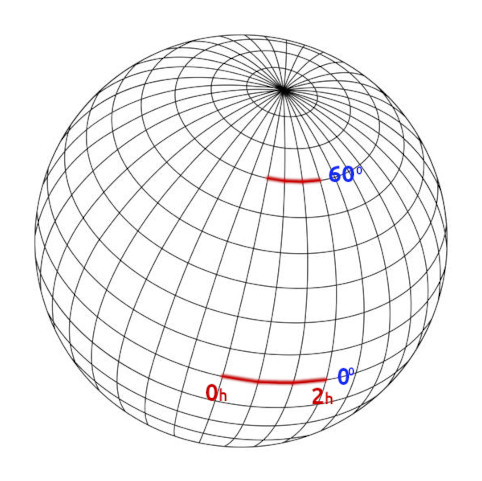
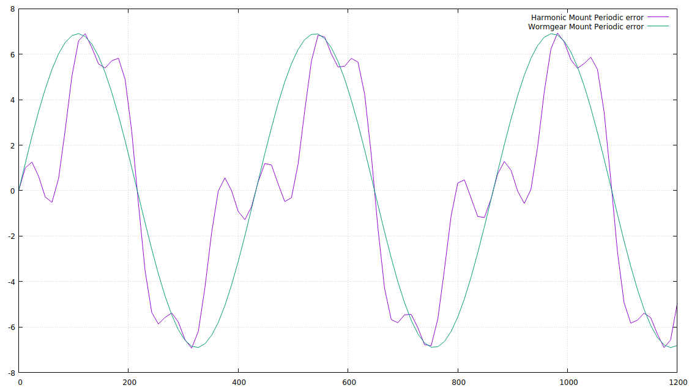
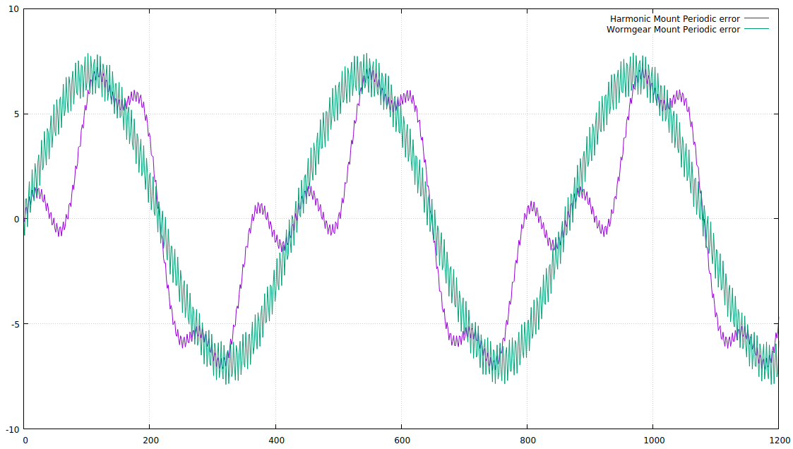

# Several Guiding Misconceptions Explained

Revision: 11.11.2022 (draft)

Author: **Rumen G.Bogdanovski**

e-mail: *rumenastro@gmail.com*

I am writing this article because I have heard these statements many times and I had to explain them over an over. I will try to explain them without going into too much details and I am not going to provide mathematical proofs of the claims. I will try to make the explanations as simple as possible, yet providing some hooks for those who want to learn more about the matter.

## Lower RMSE means better image

This is not true. Before explaining why let me explain briefly what [RMSE](https://en.wikipedia.org/wiki/Root-mean-square_deviation) means and something that is never mentioned but essential in understanding the point - the [Nyquist Frequency](https://en.wikipedia.org/wiki/Nyquist_frequency).

RMSE stands for Root Mean Square Error and it is a measure of how spread a set of data points are around some predicted or required value. The smaller the RMSE the more concentrated the measured data points are around the required value. In case of guiding the data points are the measured drifts and the required value is 0, which means no drift.

The drift is measured by comparing the positions of [centroids](https://en.wikipedia.org/wiki/Centroid) (centers of masses) of the stellar images in the guiding frame. The fact that it takes some time to measure this offset (the exposure time) means that we miss the high frequency errors. For example if we use 1 second exposures and the seeing is moving the stars around 5 times a second we can not see this in our guiding images. What we will see is a bit blurred image and the resulting centroid positions will be the average of the centroids if we were taking 10 &times; 0.1 second exposures. So we can not see the errors above some frequency limit. This limit is called the Nyquist frequency which is one half of the measurement frequency. In theory if we measure the drift in 1 second intervals (1 Hz) we can correct transient errors with duration more than 2 seconds (0.5 Hz). All higher frequency errors will be virtually invisible to the guiding and the measured drifts will be less scattered. This is because exposure acts like a [Moving Average Low Pass Filter](https://www.analog.com/media/en/technical-documentation/dsp-book/dsp_book_ch15.pdf) with a cutoff frequency of *2 &times; Nyquist frequency*. Well, this is over simplified explanation but the principle is this.

Let us return to the example above: We have a seeing with a frequency of 5 Hz and peak to peak of 2" (amplitude 1"). In order to guide it out (assuming a perfect mount that is able to correct immediately) we need to guide with at least 10Hz (2 &times; the seeing frequency) in order to "see" the seeing errors and in this case our RMSE would be close to 1". With our perfect mount we can correct these errors immediately and the final image sharpness would be close to the theoretical sharpness of the telescope, which is let us say [FWHM](https://en.wikipedia.org/wiki/Full_width_at_half_maximum) = 1". However if we use 1 second guiding exposures these 5Hz scintillation will be almost invisible, so almost no corrections will be made and the mount being perfect we would result in RMSE close to 0", and the stars will have FWHM &approx; 2". I say RMSE close to 0" as some [aliasing](https://en.wikipedia.org/wiki/Aliasing) will occur because the error frequencies are above the Nyquist frequency and the the low pass filter frequency response is not a [Heviside step function](https://en.wikipedia.org/wiki/Heaviside_step_function).

So we ended up with RMSE &approx; 0" and FWHM &approx; 2" of the stars vs RMSE &approx; 1" and FWHM &approx; 1" of the stars. Actually this is nothing new and surprising as this is the principle used in the amateur adaptive optics. There is a small and lightweight prism inside, which can move with several tens of Hertz to make these fast corrections needed to guide out 5-10 Hz or even faster seeing errors.

Here is a real life example. I took these two 300s images with my new ZWO AM5 mount from my balcony in extremely bad seeing conditions. AM5 turned out to be very responsive and I managed to prove my point. The two images are taken minutes apart and I repeated the same test several times in a row with the same result.
The images taken with 0.2s guiding exposure had total RMSE &approx; 1.2" and average median FWHM = 3.8px looked sharper than the ones taken with 1.5s guiding exposure which had total RMSE &approx; 0.7" and average median FWHM = 4.2px.

Guiding exposure of 0.2s with total RMSE 1.2", median FWHM 3.81px (looks sharper)

Guiding exposure of 1.5s with total RMSE 0.7", median FWHM 4.16px

Also RMSE does not say anything about the star shapes, and you may end up in oblong stars with an excellent RMSE. The thing is that if Right Ascension RMSE and Declination RMSE differ significantly the stars in the final image will be elongated in the direction of the axis with the larger RMSE. Actually the only conclusion one can draw from the RMSE values is the final image star roundness. If the ratio *RMSE RA / RMS Dec = 1* the stars will be perfectly round.

As stated above RMSE is not a measure of how [precise and accurate](https://en.wikipedia.org/wiki/Accuracy_and_precision) the guiding is. RMSE is a measure of how smooth the guiding is in the current conditions. One can not compare the quality of the images based on the RMSE values taken with different guiding exposures or taken with different equipment or taken in different seeing conditions etc.

## Lower RMSE means mechanically superior mount

As mentioned in the previous section RMSE is not a good metric for the final image quality. All mentioned above is valid for the mechanical quality of the mount too. However there is another factor that plays a major role here. It is the declination at which you are guiding. See the picture:

Here to describe both red arcs the RA axis rotated 30&deg; (2 hours). The arc at the equator has [great circle](https://en.wikipedia.org/wiki/Great_circle) length of 30&deg; as the equator is a great circle, and the one at Dec = 60&deg; is &approx;2&times; shorter because the telescope follows a shorter [circle of a sphere](https://en.wikipedia.org/wiki/Circle_of_a_sphere). The relation is:

*Circle length = Equator length &times; cos(Dec)*

Similarly the [great circle distances](https://en.wikipedia.org/wiki/Great-circle_distance) between the two ends of the arcs with the same RA difference at different Declinations, will be different. And for small angles the relation shown above is a very good approximation.

The same apples to the RA error. Same erratic movement of the RA axis will describe arcs with different lengths at different Declinations. At the equator, RA error will describe an arc on a great circle, therefore the error will be the most prominent. On the other hand at the pole there is no circle, it collapses to a point (*cos(90&deg;) = 0*) and the RA error becomes 0, following the cos(Dec) rule. This means that with the same mount, if you guide at the equator (Dec = 0&deg;) and you get RA RMSE = 0.5", at Dec = 60&deg; with the same mount you will get RA RMSE &approx; 0.5"&times;cos(60&deg;) = 0.25" and going 10&deg; further to the pole, at Dec = 70&deg; the RA RMSE would be 0.17".

What comes to the declination the said above is not valid, it always follows a great circle, therefore the declination difference is always a great circle distance.

So, if you can get so different RMSE values with a single mount, how can you compare two mounts by RMSE only? It just makes no sense. You should at the very least specify the declination at which you get those numbers (not to mention the factors mentioned in the previous section).

## Better polar alignment means better guiding

Sometimes it is quite the opposite. Most amateur mounts have relatively large backlashes, some even have quite stiff Declination axis. Close to perfect polar alignment will require Declination corrections in both directions. This means that the backlash will play a role when the direction of the correction changes and may lead to several overshoots before settling. In this case it is better to have a bit of polar error. This will introduce a sight drift and will ensure declination corrections in only one direction.

Some will argue that the drift will introduce large errors to be corrected. Actually no. If we have 10' polar alignment error we will have accumulated drift of 10' in 6 hours of tracking and the drift rate will be about 0.028"/s which can be easily guided. And if the mount has no periodic error, unguided 30 sec exposure will have just about 0.8" drift error.

## Several arc minutes of polar alignment error will lead to considerable field rotation

It depends, but generally it is not an issue. The bigger the field of view the worse the field rotation. Therefore let us assume that we have a relatively large field of view of 3&deg; and a total polar alignment error of 5'. The [math](http://celestialwonders.com/articles/polaralignment/PolarAlignmentAccuracy.pdf) says that with 600s subs at the celestial equator the stars at the edge will be elongated by 0.35" and at 60&deg; declination the elongation will be by 0.69". So with a good seeing of 1.5" it will be barely noticeable and the optical aberrations of the system at the edge of frame will have more noticeable effect.

With 1&deg; field of view at the celestial equator the star elongation will be a mere 0.12" and at 60&deg; declination will be only 0.23". Also halving the exposure time to 300s the numbers above are halved too.

Please note that telescope with diameter of 120 mm has theoretical [airy disk](https://en.wikipedia.org/wiki/Airy_disk) size of approximately 1" and all the numbers above are well within this number. For larger telescopes the seeing is the limiting factor.

Do not be too obsessed with the polar alignment. In most of the cases polar alignment error of 5' is more than enough.

## Perfect balance is essential for a good guiding

This does not apply to [strain wave gear](https://en.wikipedia.org/wiki/Strain_wave_gearing) (Harmonic drive) mounts. They do not need balancing at all. They do have a way to attach counter weights but they are more to keep the center of gravity within the base, so that the telescope will not tip over rather than easing the motors.

What comes to the [worm gear](https://en.wikipedia.org/wiki/Worm_drive) mounts a sight imbalance will actually make the guiding better. The thing is that they all have some backlash in both RA and Dec and if the balance is perfect slight gust of wind or the inertia of the guiding pulse can make the mount wobble within the backlash play. To avoid that it is a good idea to have a certain amount of imbalance in both RA and Dec, so that the gravity will always clear the backlash in one direction. There is a technique called *\"East heavy mount balancing\"* used for better guiding which utilizes this principle.

## The bigger the periodic error the worse the guiding

The truth is that the periodic error (PE) amplitude itself is only a part of the equation. It does not mean anything without some other parameters. The most important in this case is the error period. Two mounts with the same peak to peak PE and sinusoidal PE curve but different periods will perform differently.

The graph below shows two mounts with sinusoidal PE curves and same peak to peak PE of 14" but one has 300s period and the second has 600s period. The first one will go from +7" to -7" in 150s and the second in 300s. Therefore with the same guiding cycle (guiding exposure) the second mount will perform better as it will drift slower.

Sinusoidal PE curves are not always the case, they are more typical for the worm gear mounts. Lately strain wave gear (Harmonic drive) mounts are becoming popular but this is not the case with them. They tend to have quite rough and asymmetric PE curves.

The graph below shows typical worm gear and typical strain wave PE curves. It is easy to see that the strain wave curve has steeper slopes despite the same peak to peak PE (14") and period (432s). In this case with the same guiding exposure time we can expect the worm gear mount to perform better.

As we can see it is not the PE amplitude what is important but the steepest [slope](https://en.wikipedia.org/wiki/Slope) of the PE curve. It is measured in arc seconds per second ("/s) and tells us how many arc seconds of drift will be accumulated for one second of tracking.

Looking at the graphs above the steepest slopes for both curves are when they cross 0 (but this may not always be the case). So let us estimate the slopes for both mounts.

- Worm gear mount: starting at &approx;180s to &approx;250s PE drops from +4" to -4" and the slope is *(+4" - (-4")) / (250s - 180s) = 8" / 70s = 0.11"/s*

- Strain wave gear mount: starting at &approx;200s to &approx;230s PE drops from +4" to -4" and the slope is *(+4" - (-4")) / (230s - 200s) = 8" / 30s = 0.27"/s*

So in this case with the same guide exposures we can expect that the worm gear mount will be more than two times more accurate than the strain wave gear.

So far so good, but the PE curves may not be as smooth as in these examples. Sometimes the curves may show significant high frequency errors and this is where the things become ugly.

The picture above shows the same two graphs with the same period, same amplitude but this time they are not so smooth and the worm gear mount has four times bigger high frequency (HF) random errors. Sometimes these errors last for less than a second and are really hard to correct. You may need to use short guide cycles but the mount may not be responsive enough to correct them. In this case using longer exposures will result in better RMSE values but the final images may not improve. Some budget mounts have HF random errors bigger than 1".

So it is not the PE amplitude, it is the PE curve slopes and the HF random errors that will manifest as guiding errors.

Clear skies!
