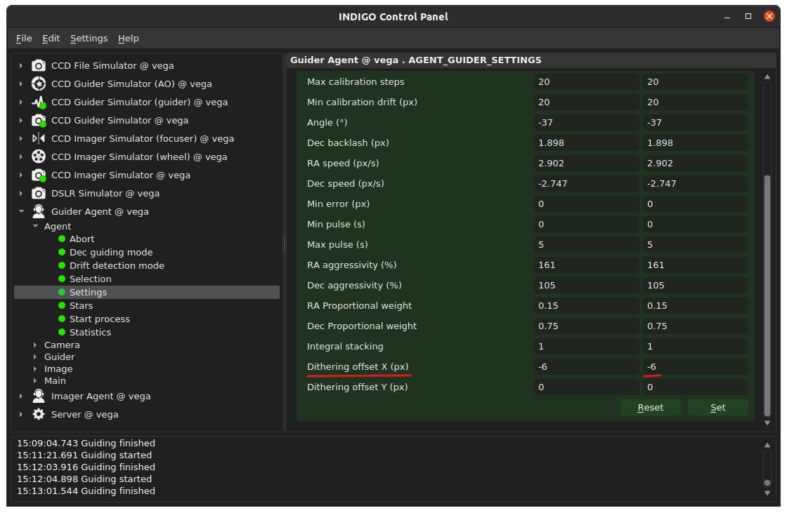
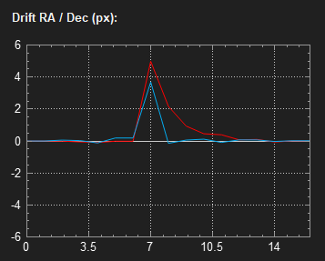
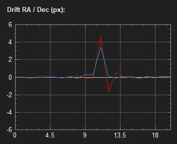
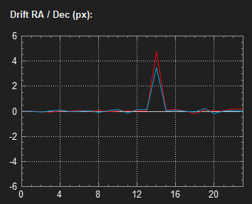
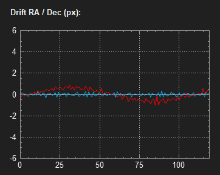
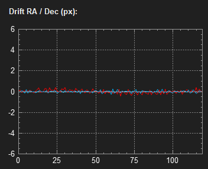

# INDIGO Guider Agent - PI Controller Tuning

Revision: 18.02.2021 (draft)

Author: **Rumen G.Bogdanovski**

e-mail: *rumen@skyarchive.org*

## Drift Controller Settings

Indigo_agent_guider uses *Proportional-Integral* (*PI*) controller to correct for the telescope tracking errors. *Proportional* or *P*
means that it will attempt to correct for any random errors like gusts of wind, random bumps etc. *Integral* or *I* means
that it will look at the last several frames and compensate for any systematic drifts like bad polar alignment, periodic
errors etc.

The drift controller has many parameters that can be configured. Some of them will be configured automatically
during the calibration process. The defaults for other settings should be good enough for most of the cases, however
to get the best performance one may need to tweak them.

Here we will look only in *Proportional Integral* controller settings. Which are described in the Guider Angent readme (link here).

* **RA Aggressivity** and **Dec Aggressivity** - They are the only parameters that are related to *P controller*. In most of the cases those two parameters will be enough to set. They represent how many percent of the last measured drift will be corrected.

* **RA Proportional weight**, **Dec Proportional weight** are numbers between 0 and 1 (1 - pure *P Controller*, 0.5 - equally *P* and *I Controller* and 0 - pure *I controller*). this is used to Setup the Aggressivity of the *I controller* In relation to P controller.

* **Integral stacking** - the history length (in number of frames) to be used for the *Integral* component of the controller. If stacking is 1 (regardless of the values of the **RA Proportional weight** and **Dec Proportional weight**) the controller is pure *Proportional* as there is no history.
Default value is 1 which means that pure *P controller* is used, but if a *PI controller* is needed a good initial value would be around 10.

* **Dithering offset X** and  **Dithering offset Y** - Add constant offset from the reference during guiding in pixels. The values are reset to 0 when a guiding process is started. We will need those to params to check the impulse response of the guider while tunning.

## Tuning the Drift Controller (P-only controller)

1. Set **RA Proportional weight** and **Dec Proportional weight** to 1.
(P-only Controller). And set **RA Aggressivity** and **Dec Aggressivity** to ~90%.

2. Start the guiding and after it settles set dithering offset to X (or Y) of several pixels (5 or 6 px is OK) to simulate a bump in the guiding as shown on the screenshot:

3. Check the guiding response. If the response is too slow like on the picture, the **Aggressivity** for this axis should be increased. In this case the red line is Right Ascension so we need to boost **RA Aggressivity**.

4. If the guiding response is overshooting, **Aggressivity** Should be decreased. Here we went too far with **RA Aggressivity** and we need to reduce it.

5. Repeat the process until response is fast and accurate (as shown)

With this the Proportional controller tuning is complete. And it is safe to stop here. It will perform excellent for most of the cases.

## Tuning the Drift Controller (PI controller)
PI controller is needed in rare cases when there is are significant systematic errors like periodic error (PE) or significant drift due to a bad polar alignment that can not be compensated by the *P-only* controller. This usually happens with long guiding cycles of more than 10 seconds and in most of the cases this can be fixed by reducing the cycle to 2-3 seconds.

If this does not help and there is a drift or the mount PE is still visible in the guiding graph, as shown below then *PI controller* is here to help.

### Tuning Procedure
1. Completete the P-only controller tuning procedure.

2. Set the **Integral stacking** to a reasonable value ~10-15 frames.

3. Set the **Proportional weight** to around 0.7 for the axis that shows the error (in this case RA is showing significant PE). Let it run for several minutes (a full PE cycle).

4. Check the if the error is still there. If it is Repeat 2 until it is gone. Please be conservative with **Proportional weight** as bringing it way down may result in slow drifts or sudden jumps. It is preferable to leave a bit of the error not sacrificing the stability. This is how a well tuned controller should perform:

5. Now we need to test its response to sudden jumps, as described above in the P-only controller tuning. If we have over reaction or slow reaction **Aggressivity** for the corresponding axis should be adjusted again.

Please note that if you have bad polar alignment guiding will not save you from field rotation.

Clear skies!
