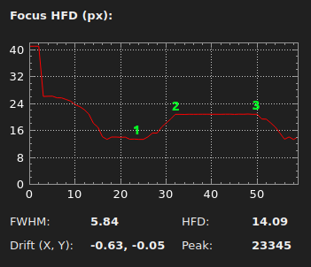

# INDIGO Imager Agent - Autofocus Tunning Guide

Revision: 03.28.2024 (draft)

Author: **Rumen G.Bogdanovski**

e-mail: *rumenastro@gmail.com*

## Autofocus Quality Estimators
INDIGO Imager Agent can use two focus quality metrics called Focus Quality Estimators. Each of them has its positives and drawbacks.

- **Peak/HFD** - This estimator uses the peak value of the selected star and its Half Flux Diameter (HFD) to determine the best focus. This is the default estimator. It uses a selection with a given radius (see **Selection Radius**) for the estimation. If the star is highly defocused the HFD may not be measurable and the focusing procedure will fail.
- **U-Curve** - This estimator uses the HFD of the selected star (see **Selection Radius**) as a focus quality estimation. If the star is highly defocused the HFD may not be measurable and the focusing procedure will fail. This estimator looks for the best focus by moving the focuser in one direction and looks for HFD minimum with a step specified in **Initial / U-Curve step**. It collects several data points on each side of the focus and using a Polynomial fit it estimates the best focus and moved the focuser to this position.
- **RMS contrast** - This estimator uses Root Mean Square (RMS) contrast of the whole image to determine the best focus. This method works fine with highly defocused images. It can find a perfect focus form virtually any focuser position as long as the image has some features on it. As a downside of this method should be mentioned that saturated stars will fool it and it will not find the perfect focus. To fight this, INDIGO 2.0-166 introduces masking of the saturated areas. If saturation is detected, the saturated area is excluded from the RMS contrast estimation and focusing statistics are reset. Then the autofocus process is resumed. This can be avoided with shorter exposure time, lower gain, or just by avoiding bright stars in the focusing frame (see **Selection Subframe**).

Focus quality estimators will not work correctly if used with Bachtinov mask. If the mask is on during the AF process, the end focus will either fail or will be reported ok while in fact it is not. Bachtinov mask can be used to verify the final focus but not during the AF process.

## Autofocus Tuning Parameters
In INDIGO Imager Agent auto-focus starts with a large step to approximate the focus and progressively decreasing it until it finishes making adjustments with its final step. This is why the final step is important for the focusing accuracy.

- **Initial / U-Curve step** - This is a big step. With this step the focusing difference should be clearly visible. The value is in focuser steps. A reasonable value to start with is 5 - 7 times the critical focus zone (CFZ) but it can be as large as 10 - 15 times the CFZ. **Initial / U-Curve step** is also used as a safety limit. The focusing will fail if the focus is not reached within *40 * Initial / U-Curve step* steps from the initial focuser position for **RMS contrast** estimator and *20 * Initial / U-Curve step* steps for **Peak/HFD** and **U-Curve** estimators. If this value is large, the defcusing may be too high and the HFD may not be measurable, which in turn, may fail the **Peak/HFD** and **U-Curve** focusing procedures.

- **Final Step** - The size of this step is critical for the focusing accuracy. It should be smaller than CFZ a good value would be around CFZ/2 in focuser steps. Much smaller values than CFZ/3 may lead to hunting and failure to settle. This parameter is used by **RMS contrast** and **Peak/HFD** estimators.

- **U-Curve fitting samples** - This parameter specifies how many sample points will be used for the Polynomial fitting for estimating the best focus position by the **U-Curve** estimator. Usually more points manage better the bad seeing and lead to better focus estimation. However the worst the seeing the larger **Initial / U-Curve step** should be, which limits the number of sample points with a measurable HFD.

- **Backlash (total)** - this value is the backlash of the focuser. It assumes symmetrical IN and OUT backlash. Most of the system have symmetrical backlash.

- **Backlash (in)** and **Backlash (out)** - in the rare cases of an asymmetrical backlash these values should be set. Most users can safely ignore them. They are relative to **Backlash (total)**. When moving inward, *Backlash (total) + Backlash (in)* is applied and when moving outward *Backlash (total) + Backlash (out)* is applied. These values are ignored if backlash overshooting is enabled.

- **Backlash overshoot factor** - Backlash overshooting is an autofocus technique to compensate for the backlash by overshooting the target position by a large amount and then moving the focuser back to the initially requested position. This method is much more forgiving than absolute backlash compensation and is recommended for focusers with large backlash or when the backlash value is approximate. The default value is 1 which enables the absolute backlash compensation and the **Backlash (total)** should be an accurately measured value. If the **Backlash overshoot factor** is larger than 1 the overshoot compensation algorithm is enabled and **Backlash (total)** is multiplied by **Backlash overshoot factor**. The resulting value should be larger than the real backlash to achieve backlash overcompensation because the rule for the overshooting to work is: *System backlash < Backlash (total) * Backlash overshoot factor*. Overshoot technique can be useful for the SCT users because it will make mirror flop less likely and for the rack and pinion focusers as it will avoid the outward slip due to the clearance between the interlocking teeth of gears. Overshooting will not work if the system backlash is asymmetric, because of that **Backlash (in)** and **Backlash (out)** values are ignored when overshooting is enabled. The value of *Backlash overshoot factor* can be easily determined by trial and error. However if the backlash is approximately known a value of 1.5 should be fine.

- **Stacking** - this value is in frames. It means how many exposures to take and evaluate before making the next focuser move. This value could be 1-3 for steady atmosphere but > 3 for a visible scintillation.

- **Selection Radius** - this is the box size (in pixels) in which the HFD and FWHM of the selected star will be evaluated. It is important to mention that the initial (unfocused) stellar image should fit in this selection. If the star is larger focusing will most likely fail. On the other hand if the selection radius is too large HFD and FWHM estimations will be less accurate. A good value for most of the cases is 8 - 10 pixels for **Peak/HFD** and about 10-20 for **U-Curve**. This Value is irrelevant for **RMS contrast** focus quality estimator.

- **Selection Subframe** - This defines a region of interest (ROI) around the selected star to be used for focusing. It is specified as times the **Selection Radius**. The default value for **Selection Subframe** is 0 which means that the whole image is used. Value of 5 means that the ROI will be a square around the selected star with size *5 * Selection Subframe*. Please note that the ROI may not be centered around the selection as many cameras do not allow ROIs starting at any pixel position. This can be used to make the focusing faster with CCDs with slow read frame out or to avoid over-saturated stars with the **RMS contrast** focus quality estimator.

## Determining the Backlash
If the backlash of your focuser is larger than 0.5 CFZ, it plays a critical role in the focus accuracy, so determining it is important.
For better precision it is advised to repeat the procedure several times in both directions.

If the average values for IN and OUT directions differ significantly you should set **Backlash (in)** and **Backlash (out)** using the average values. Otherwise you can set **Backlash (total)** with the average of all runs.

We provide two methods of determining the Backlash. You can use the one you prefer.

### Determining the Backlash Using Bachtinov Mask
This procedure is simpler to perform but it requires a Bachtinov mask.
1. Set the backlash value to 0 and start from a visibly defocused state.
2. Place the Bachtinov mask on the telescope and determine the direction in which the focus is improving.
3. Start moving the focuser in this direction with small steps, one move at a time, until you reach the perfect focus, be careful to avoid overshooting.
4. Once the focus is reached, command the focuser to make a relatively large move (larger than the expected backlash) in the same direction, something like 200 or 300 steps will be enough in most cases.
5. Command the focuser to move in the opposite direction with the same amount of steps. Check the focus. If the focus is perfect the system has no backlash and you are set, but usually there will be some amount of defocus. In that case record the final position. Let us say **8000**.
6. Start moving the focuser manually with small steps, one move at a time, in the direction of the last move, until you reach the perfect focus, and again be careful to avoid over shooting. Then record the final position. Let us say **8016**.
7. Subtract the two recorded positions and this is your backlash. In our case it is **8016 - 8000 = 16 steps**.

### Determining the Backlash (no additional accessories required)
This procedure is simple but a bit fiddly.
1. First you need to set the backlash value to 0.
2. Start "Manual" focusing mode and go somewhere near the focus (point 1 on the picture below).
3. While looking at the HFD of the selected star, make small moves one at a time in one direction until you reach some point where the HFD is larger than the one of the focused star (point 2 on the picture). Try to move with 1 or 2 focuser steps.
4. Record the focuser position at this point, let us say **8000** and let it settle for several exposures. The HFD should slightly oscillate around the same average value.
5. Then move the focuser in the opposite direction with the same step and let it run for several exposures. If the average value of the HFD decreases your step is either too large or your backlash is negligible. If it does not change make another move in the same direction. Let it run a bit and if the average is still the same make one more step until HFD starts to decrease (point 3 on the picture). Then record this value again. Let us say **8016**. Make several more steps to make sure HFD decreases steadily.
6. Subtract the the two recorded values and you will get the backlash. In our case it is **8016 - 8000 = 16 steps**.

**NOTE:** Good seeing is essential for better results.

## Determining the System Critical Focus and the Focuser Final Step

The zone of critical focus is considered the zone around the perfect focus that can not be distinguished from the perfect focus.

### A Bit of Theory
There are several theories about how wide it should be. The generally accepted theory about the diffraction limited CFZ does not
take in to account the seeing conditions and overestimates the Airy disk of the system by a factor larger than 2. Which clearly
means that in excellent seeing conditions one can not reach excellent focus using CFZ as criteria.

This is why in this guide we will use the New CFZ as defined by GoldAstro.com.

 **NCFZ = 0.00225 . &theta;FWHM . t-2 . A . f2**

Where:
- **NCFZ** - New Critical Focus Zone (micrometers)
- **&theta;FWHM** - total seeing (arc seconds)
- **t** - focus tolerance as a percentage of total seeing (unitless)
- **A** - telescope aperture (millimeters)
- **f** - effective imaging system f/ratio (unitless)
- **0.00225** - constant (micrometers per arc second per millimeter)

We can further simplify this formula by making some assumptions, According to GoldAstro even the most experienced eyes can not distinguish the FWHM change less then 10-15% (which is way less than what CFZ claims) so we can safely assume **t** = 15%, (15-2 = 3.87298):

**NCFZ = 0.00871 . &theta;FWHM . A . f2**

What comes to the total seeing there are 2 main factors to be considered:
1. Pixel size in arc seconds / pixel
2. Astronomical seeing in arc seconds

Obviously if the Astronomical seeing of good night is 1.5" and the imaging system has 2"/px resolution there is no way to resolve the Astronomiclal seeing, that is why we need to use:

**&theta;FWHM = MAX(Astronomical seeing, Pixel size)**

For a typical clear night it is safe to assume the seeing will be worse than 1.5" or 2".

**NOTE:** For deep sky imaging with guiding enabled it is fairly safe and even somewhat conservative to assume the seeing of 2" and estimate:

**&theta;FWHM = MAX( 2", Pixel size )**

### Example
Given a Telescope with aperture 100mm F/5.6 fitted with a camera with 2.5"/px in a typical night with a seeing of 1.8" we need to calculate our Critical Focus.

In this case we take the larger value of 2.5" as we can not resolve 1.8" with our system.

**NCFZ = 0.00871 . 2.5 . 100 . 5.62 = 68um**

### Determining the CFZ and Final Step for Focusers Without a Ruler
This method will give you a rough approximation which should be accurate enough for precise focus.
1. Use Bachtinov mask to find the precise focus let it run for a while and record the average HFD value and focuser position. Let is say HFD = 4.50px and the focuser position is **8000**.
2. Then start moving the focuser in the same direction of the last move you made while focusing. Use a small step 1 or 2 focuser steps at a time, and let it run for several exposures, evaluating the average HFD after each step. Repeat this until you see the HFD increased by 15-20% (in our case ~5.2px) then record the focuser position let us say **8007**.
3. Subtract the two positions:\
 **8007 - 8000 = 7**\
 This is a rough estimation of the **CFZ / 2** and our CFZ is around **14steps**.
4. You can repeat the following procedure with several stars and use the average result.

Now as we have an approximation of the CFZ we can set the **Final step** to **CFZ / 2** (**7steps** in the example). If the focus is not accurate enough we can decrease this value a bit more.

**NOTE:** This method is sensitive to the seeing conditions. With better seeing you will get a better result.

### Determining the CFZ and Final Step for Focusers With Ruler
If your focuser has a ruler it is easier to determine the CFZ in steps.
The procedure is as follows.
1. Calculate the CFZ as described above. The calculated CFZ in the example was 68um.
2. Measure how many steeps the focuser makes to move the focuser in or out with 1cm (10 000um). Let us assume it moved 1900 steps.
3. Calculate step size using the formula:\
 **StepSize = Distance / Steps**.\
 In our case:\
 **10000um / 1900steps = 5.3um/step**.
4. Using this number we can calculate our CFZ in steps:\
 **68um / 5.3 = 12.8steps**

Now we can set our **Final step** value to CFZ / 2 **12 / 2 = 6steps** and then fine tune it, if the results are not good.

Clear skies!  
