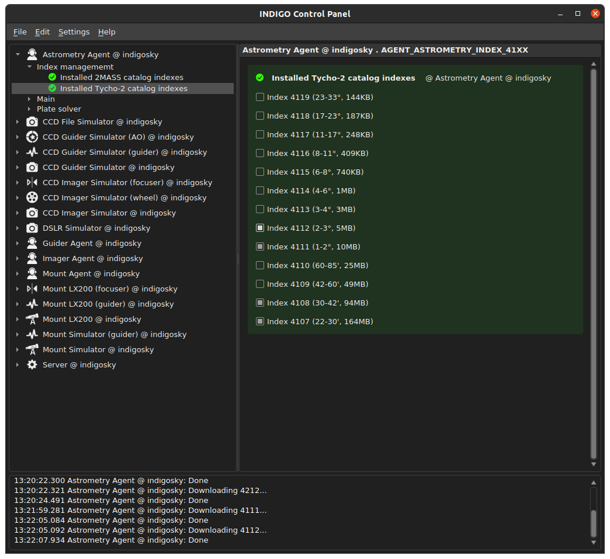
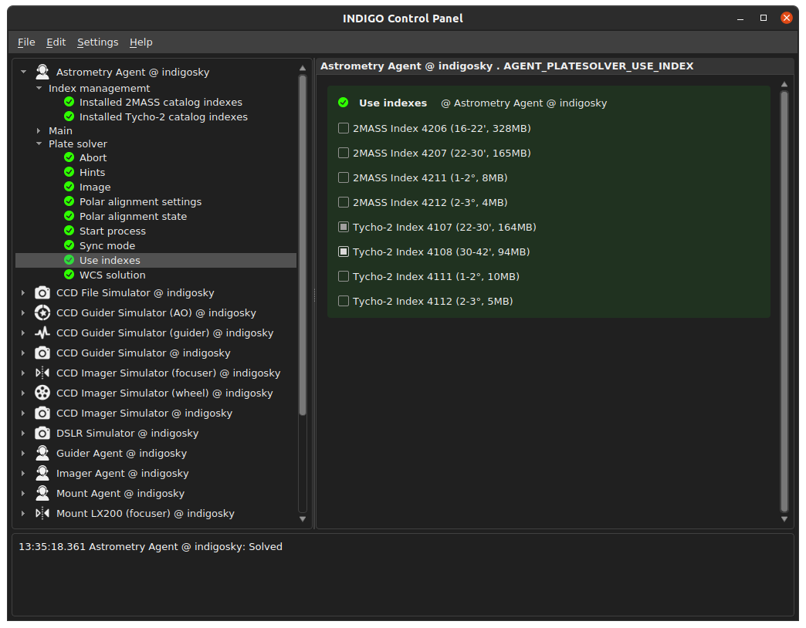
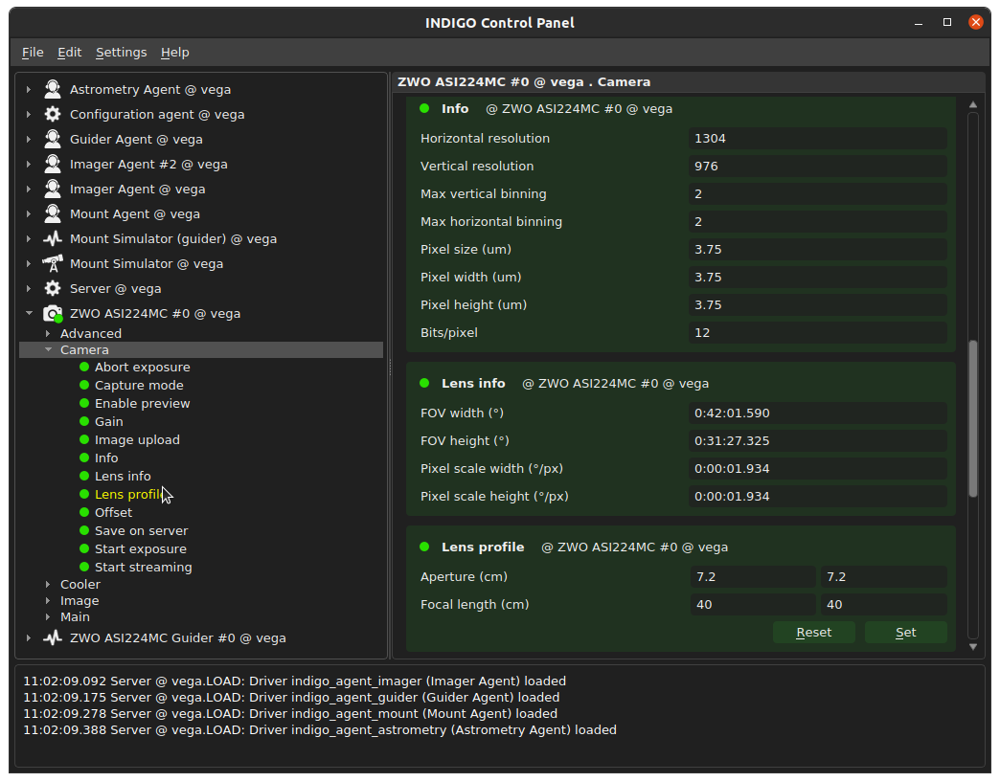
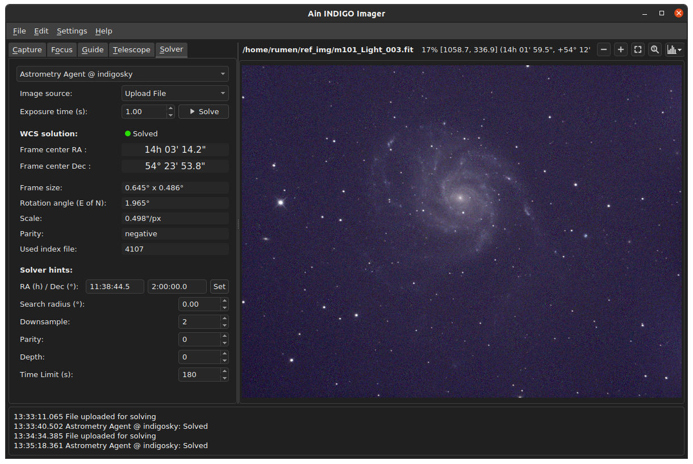
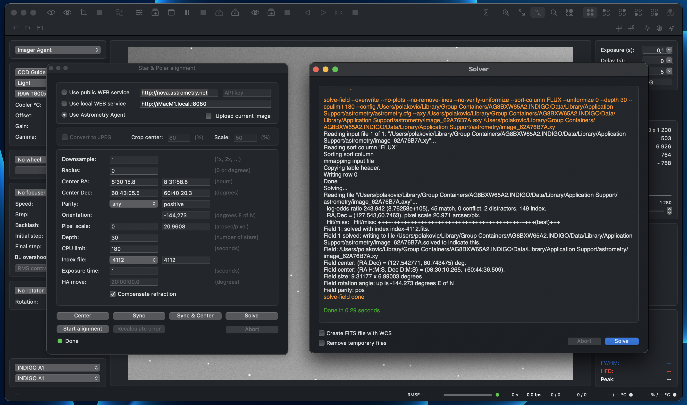

# INDIGO Astrometry Agent - Plate Solving Guide

Revision: 25.10.2022 (draft)

Author: **Rumen G.Bogdanovski**

e-mail: *rumenastro@gmail.com*

## Introduction

Plate solving is a method used to determine what exactly is depicted on an astronomical image or where the telescope is pointing in the sky by comparing the star field in the image to a database of star positions. Once a match is found the coordinates of the center of the frame (Right Ascension and Declination) are returned, accompanied by several other parameters like frame rotation, pixel scale, field of view etc. This task in INDIGO is performed by two agents:
- **INDIGO Aastrometry Agent** - uses custom build of astrometry.net engine.
- **INDIGO ASTAP Agent** - uses ASTAP engine.

ASTAP agent is deprecated and we do not recommend using it. It will not be covered in this document.

## Choosing right indexes (stellar positions databases)
The star position database is available in the form of index files specific for the solver engine. Astrometry.net engine can use two separate catalogs Tycho-2 and 2MASS.
The database consists of multiple index files that cover *skymark* sizes of different diameters. And in general you only need to download between 1 and 3 index files that match your setup. The general rule is that the *skymark* sizes should fit in the field of view (FOV) of your setup. For example if your FOV is 3.5 degrees you will likely need 1-2 degrees and 2-3 degrees index files. Also note that most likely you only need one catalog either 2MASS or Tycho-2.

By default INDIGO comes with no catalogs preinstalled. You need to download the indexes you need from the INDIGO Control Panel -> *Astrometry Agent* -> *Index Management*. Selecting the index item will download it, deselecting it will remove it from your system. Index download may take some time as indexes can be more than a gigabyte. Therefore, be patient and keep it simple - download only the indexes you need.

Once the necessary indexes are downloaded you can narrow the search and speed up the process by choosing the indexes to be used. This is useful if you have several systems with different fields of view. In this case you do not need to download and remove indexes. You just download all indexes you need and choose the ones to be used for your current setup. This is available in *Astrometry Agent* -> *Plate solver* -> *Use indexes*.

All downloaded indexes from all catalogs will be shown in *Use indexes* property. Deselecting indexes here will not remove them from the system but they will not be used.

It is a general rule of thumb that the less index files are selected the faster the solution will be found provided that the correct indexes are selected. In many cases you will need only one index - the one shown in *Used index file* item in *Astrometry Agent* -> *Plate solver* -> *WCS Solution* after a successful solution, But if no solution is found please add more indexes until a solution is found. Then you can try to narrow down the index selection.

Another approach is to let solver automatically choose the correct index from the selected indexes. This is done by setting the **Pixel Scale** parameter (described below). The main advantage of this approach is that selecting all indexes will not hinder the performance, because the solver will avoid looking through all selected indexes and go directly to the correct index if it is selected. Otherwise it will fail immediately. The main disadvantage is that indexes are gigabytes in size and will use a lot of disk space.

## Hint configuration
Some *Hints* can be provided to the solver engine to speed up the solving process as it may take a long time. Here are the parameters:
- **Search Radius** - This is the radius in degrees around the given coordinates to search for a solution. *0* means "blind solve" or search the entire sky starting from the provided coordinates.
- **RA** and **Dec** - approximate coordinates (Right Ascension and Declination) of the frame center to start the search. They can be entered manually or if a related mount agent is selected the mount coordinates will be used here. This may speedup the solution to less than a second in some cases.

- **J2000** - This is a flag indicating if the coordinates of the solution should be in J2000 or JNow.

- **Pixel scale** - If the pixel scale of the optical system is known, setting it as a hint will significantly speed up the process. This hint is in degrees/pixel (in Ain "/pixel is used). It is safe to set it to 0 (no clue), but it could solve much slower, as it will look through all selected indexes. Since INDIGO 2.0-200, solver agents can use the pixel scale of the selected camera. To enable it, the correct focal length of the telescope must be set in *CCD_LENS* property of the camera: *\<Selected Camera\>* -> *Camera* -> *Lens profile* (as shown on the screenshot) and to set **Pixel Scale** hint to a negative value (e.g. -1). Negative pixel scale tells the solver agent to use the scale of the selected camera. If the focal length of the telescope is not set the solver will assume that **Pixel scale** = 0 and will look through all selected indexes. Setting **Pixel Scale** correctly is essential as it will point the solver to one particular index file and if it is not correct the solving will fail.

- **Parity** - positive (1) or negative(-1) if unknown (0). Flipping an image reverses its **parity**. If you use a refactor telescope, it probably has negative parity. If you use reflector, it probably has positive parity. Selecting the right parity will make the solving process run faster, but if in doubt use unknown. It is advised, once there is one solved frame to use the reported parity as a hint, because this may speed up solving for the subsequent frames significantly.

- **Downsample** - You can downsample your image by a given factor before performing the source (star) extraction. This speeds up the process but a large downsamle will reduce the accuracy. Default is 2 and we recommend to use it.

- **Depth** - The solver works by looking at sources (stars) in your image, starting with the brightest. It searches for all *skymarks* that can be built from the *N* brightest stars before considering star *N+1*. When using several index files, it can be much faster to search for many *skymarks* in one index file before switching to the next one. This flag lets you control when the solver switches between index files. It also lets you control how much effort the solver puts in before giving up - by default (0) it looks at all the sources in your image.

- **CPU limit** - CPU time limit in seconds before giving up. Default is 180s which is probably too much. Usually if it does not solve the image in several tens of seconds the configuration needs to be optimized.

On a desktop computer for a properly configured solver the solution should be found in up to 10 seconds. For a Raspberry Pi up to 30-40 seconds should be enough, but it depends on many factors like image size, image FOV, CPU performance, disk performance etc.

## Image sources
INDIGO plate solver agents can solve images from two different sources:

- **Related agents** - *Guider agent*: it will solve the image acquired by the selected guiding camera and *Imager Agent*: it will solve the image from the selected imaging camera.

- **Disk file** - the client will upload a disk file for solving.

Plate solver agents support wide variety of input image formats: INDIGO RAW, FITS, JPEG, and virtually all Camera RAW formats like CR2, NEF, MRW, ARW etc.

Here is a view of the solver tab in Ain INDIGO Imager:

Here is a view of the solver window in INDIGO A1:

## The most effective ways to optimize the solver performance
There are two main ways to improve significantly the overall solver performance:

1. Use the correct index - choose it manually or automatically (by setting the correct **Pixel scale** hint).

2. Use correct **Parity** hint.

Clear skies!  
