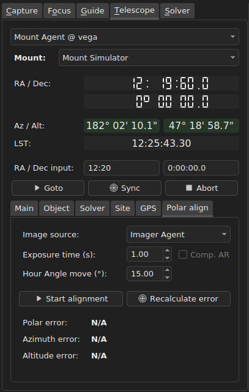
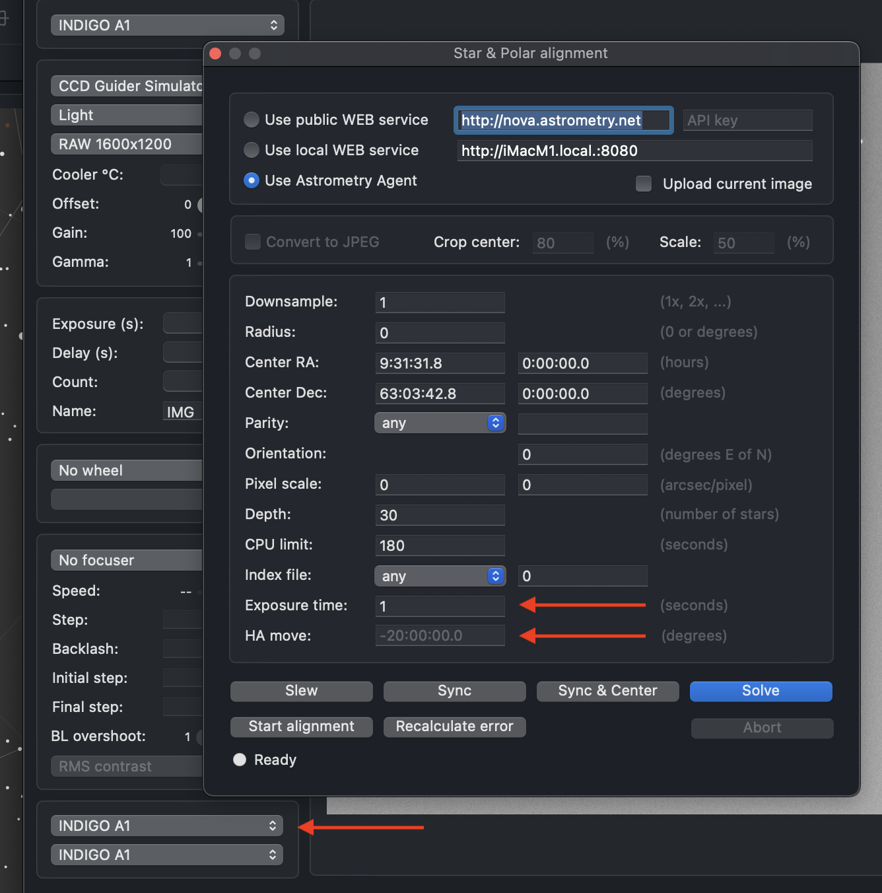
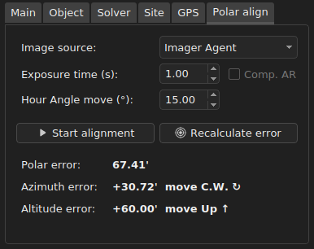
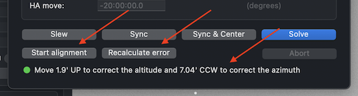

# INDIGO Astrometry / ASTAP Agent - Polar Alignment Guide

Revision: 10.10.2024 (draft)

Author: **Rumen G.Bogdanovski**

e-mail: *rumenastro@gmail.com*

## Introduction

Equatorial mounts have two axis - Right Ascension / Polar axis and Declination axis. The good polar alignment is critical for these mounts for accurate tracking. This means that the RA / Polar axis should be parallel to earth's rotation axis.

INDIGO uses 3 point polar alignment (3PPA) procedure. This method is derived from the drift alignment method and it does not require a celestial pole view (in fact 3PPA will not work if the telescope is pointed close to the pole). It relays on the mount GOTO functionality and plate solving. 3PPA method will move the telescope twice in Hour Angle with a specified amount and will take one exposure at start, one in the middle and one at the end. Then it will calculate the polar error based on the drift in Declination and will give clear instructions how to correct it. If the atmospheric refraction correction is off for better results the mount should be trained above 35-40 degrees in altitude. A good starting point is 35-50 degrees in Altitude, just passed the meridian. It is not mandatory but this way meridian flip will be avoided and usually the mount can safely move the required distance in Hour Angle.

## Configuration
- **Exposure time** - This is the exposure time in seconds used for the frame acquisition. Usually several seconds is enough.
- **Hour angle move** - This is how much the mount should move in Hour angle (-Right Ascension) between the exposures in degrees (15 degrees = 1 hour). In the northern hemisphere positive value will move the mount Clockwise (as seen from above the mount, looking down the polar axis), negative - Counterclockwise or vice versa in southern hemisphere. The recommended value is between 15 and 25 degrees (See the safety note below).
- **Compensate refraction** - This is a flag indicating weather to compensate for the atmospheric refraction during the calculation of the polar error (0 = off, 1 = on). In *Ain INDIGO Imager* it is exposed as a checkbox labeled "*Comp. AR*".
- **Related Agents** - The polar alignment will work only if image source agent and the mount agent is selected. This is usually done in the client.

 Here is how it looks in Ain INDIGO Imager - "Mount Agent @ vega" is selected to control "Mount Simulator" mount. Images will be taken by "Imager Agent":

 

 And this is how it looks in *INDIGO A1* on MacOS:

 

## Running the process
1. Make sure your polar axis is roughly pointing to the celestial pole. It should not be more than 5 degrees off. To achieve that, level your mount and set the correct latitude using the latitude scale on the mount. Then point the polar axis using a compass. This procedure should give you polar alignment good enough to start the process.
2. Point the mount above 30-35 degrees in altitude (but far from the zenith), preferably close to the meridian. If **Hour angle move** is negative you should be before the meridian and if positive past the meridian to avoid meridian flip. Please note if the final position is close to 90 degrees azimuth (due east) or 270 degrees azimuth (dew west), the polar alignment calculation will not be accurate. This is another reason to start close to the meridian. Zenith is also to be avoided, because the center of gravity may move the telescope from one side of the Declination backlash to the another, or the telescopee may end up pointed to the azimuth no-go zones mentioned above.
3. Click on "Start alignment". This will take some time. The agent will take three exposures and solve them, and move mount between them. When it is done it will show the error and give you clear instructions how to correct it.

 This is how it looks in *Ain INDIGO Imager*:

 

 And in *INDIGO A1*:

 

 Additionally it will print in the log messages like this:

 ```
 03:39:57.092 Polar error: 67.41'
 03:39:57.092 Azimuth error: +30.72', move C.W. (use azimuth adjustment knob)
 03:39:57.092 Altitude error: +60.00', move Up (use altitude adjustment knob)
 ```

**Note:** *C.W.* is Clockwise and *C.C.W.* is counterclockwise as seen from above the mount, looking down the polar axis.

4. Follow the instructions and move the mount polar axis using the altitude and azimuth polar alignment knobs. **Do not touch Right ascension and Declination!** Moving in Right ascension or Declination will lead to wrong polar error estimation and wrong polar alignment.

In the example above we should move clockwise (C.W.) in azimuth and up (Up) in altitude.

5. Now click "Recalculate error". This will take another exposure and give you another polar error estimate:

 ```
 03:40:34.664 Polar error: 18.89'
 03:40:34.665 Azimuth error: +11.64', move C.W. (use azimuth adjustment knob)
 03:40:34.665 Altitude error: +14.88', move Up (use altitude adjustment knob)
 ```

6. Repeat steps 4 and 5 until the polar error is acceptable:

 ```
 03:41:36.800 Polar error: 0.87'
 03:41:36.801 Azimuth error: +0.84', move C.W. (use azimuth adjustment knob)
 03:41:36.801 Altitude error: -0.24', move Down (use altitude adjustment knob)
 ```

## Notes
1. If the initial error is larger than 5 degrees the process will fail and ask for better initial polar alignment.
2. If the initial error is more than 3 degrees it is recommended to repeat the alignment process for better accuracy.
3. Do not touch the telescope tube during the process and be gentle with the corrections. Any small moves in RA or Dec during the polar alignment process will lead to polar alignment inaccuracy. For the same reason Zenith is to be avoided because the telescope may change the balance point and move from one side of the Declination backlash on the other, effectively changing its Declination.
4. It is recommended that the mount is above 30-35 degrees in altitude (but far from zenith) at its lowest during the polar alignment process. This will minimize the effect of Atmospheric Refraction. Alternatively you may want to turn on the atmospheric refraction compensation.
5. Do not change **Compensate refraction** during the polar alignment process. If you do so, the alignment will not be accurate. In this case you should restart the polar alignment process.
6. Polar alignment end position should not be close to 90 degrees (due East) and 270 degrees (due West) in azimuth. Close to these azimuths turning the altitude knob is translated to azimuth move of the telescope tube and there is no way to move it in altitude. This makes it impossible to correct the polar error while looking through the telescope. For similar reasons even the calculation of the polar error at these azimuths is not precise.
7. This method will not work close to the celestial pole. In this case moving the telescope in right ascension will result in very small moves in azimuth and altitude which will lead to a large error in the estimated polar error.
8. The polar error estimate may vary between different runs with several arc minutes. There are many reasons for that - cone error, periodic error, backlash, camera pixel scale etc. Do not be too picky on that.
9. Polar error of several arc minutes (even up to 10') is okay for most of the setups.
10. Once the polar alignment process is complete you must perform star alignment. Otherwise your GOTO will be inaccurate.

## *Safety Note*
*Please make sure the mount has enough room to move twice the **Hour angle move** in the specified direction. The mount will move automatically and it may hit something which may result in damage. So, if you are in the northern hemisphere and the **Hour angle move** is set to -20 degrees, make sure the mount can safely move 40 degrees counterclockwise.*

Clear skies!  
