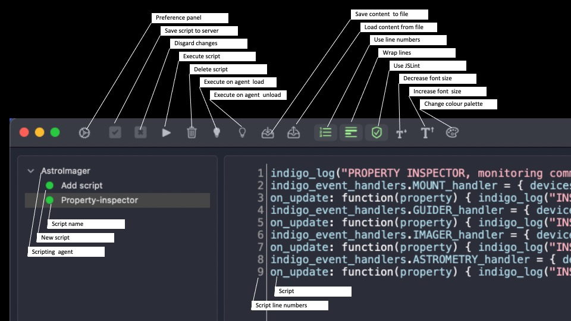

# Basics of INDIGO Scripting
Revision: 20.06.2023 (v4)

Author: **Johan Bakker**

e-mail: *johan.bakker@unifiedvision.nl*

## Introduction to indigo scripting

Indigo provides a scripting interface that allows for execution of custom build scripts that can read Indigo property values and states from a running Indigo server, change property values within the running Indigo server and thereby also execute Indigo functionality. In the [Scripting section on the Cloudmakers forum](https://bb.cloudmakers.eu/viewforum.php?f=18) users have posted scripts that, for example, read SQM values or temperatures from devices and store these values in custom FITS headers, turn on/off dew heaters or powerbox ports, control dithering or perform a meridian flip that includes plate solving and guider calibration.

The engine that interprets and executes the scripts is a [Duktape engine](https://duktape.org), which is a [Java Script](https://www.w3schools.com/js/default.asp) based engine that uses the [ECMAScript 2009/ES5](https://262.ecma-international.org/5.1/) coding standard. This manual provides an overview of commonly used concepts, for the full syntax guide is referred to the Java Script and ECMAScript 2009/ES5 documentation mentioned above. The scripting engine has custom bindings to the Indigo platform. These bindings are basically the Indigo specific “commands” that can be used from the scripts to interact with the Indigo platform. The commands are described in more detail in the section “Writing a script” further down.

A script allows for defining event_handlers and timers that can trigger the execution of certain functionality within the scripts. The Indigo platform as well as script execution are both fully asynchronous and there are no “sleep” commands to wait for some condition, i.e. when an event_handler or timer is triggered, the related part of the script is executed and exits. More complex functionality is therefor typically realised by using a cascade of different event_handlers, where the execution of the functionality in one event_handler, triggers the conditions of another event_handler, which triggers another and so on.

## Using Indigo Script editor

Scripts are written in the Indigo Script Editor. When you open the script editor, you see the user interface like in the picture hereunder. The left pane lists the Indigo Scripting Agents that are visible on the network. There can be more than one scripting agent, each listing the scripts that are available in that particular agent. A Scripting Agent is by default present in the Indigo Server process, the Indigo Server desktop application and the applications AstroImager, AstroTelescope, AstroGuider, AstroDSLR, Indigo Dashboard, A1 and D1.



The menu bar presents the following buttons;

- **Preference panel** - the Indigo  preferences, services and ports.
- **Save script to server** - saves any changes in the script to the scripting agent
- **Disgard changes** - discards all changes since the last save and reloads the script from the scripting agent
- **Execute script** - executes the current script. Errors will be visible in the log window at the bottom
- **Delete script** - removes the current script from the scripting agent, this action cannot be undone
- **Execute on agent load** - the script will be executed when the process containing the scripting agent starts
- **Execute on agent unload** - the script will be executed when the process containing the scripting agent stops
- **Save content to file** - exports the current script to a file of your choosing, i.e. for backup purposes
- **Load content from file** - imports a script from a file and loads it into the selected scripting agent
- **Use line numbers** - display line numbers in front of the script lines
- **Wrap lines** - wraps the script lines when the editor window is to small to show the entire line
- **Use JSLint** - use JSLint to automatically check the script for syntax errors (this is a very useful tool!)
- **Decrease font size** - use a smaller font
- **Increase font size** - use a larger font
- **Change colour palette** - change the colour palette of the script text

## Getting started

Make sure the Indigo server or application in which you want to create a script is running and start the Indigo Scripting Editor. In the left pane you will find the available scripting agent(s). If the scripting agent you are looking for is not listed,  wait 10-20s to see if it pops up after discovery. If it doesn't show up you may need to tweak the Indigo ports in the Indigo Preference panel or your network settings. Expand the scripting agent you want to write a script for by clicking on the downward arrow and select “Add script”. Next type the first line of your new script in the editor pane, e.g. ;
```JS
indigo_log(“Hello world”);
```
Since the script text has been changed, the “Save script to server” button is now enabled. Press this button and a new script with the name “New script” will appear in the list. You can click on the name “New script” to give your script a proper name. And you’re good to go! Create your script and make sure to save your changes to the server. Execute the script to test it and fix any issues until it works. When it works, select when you want the script to execute; on-agent-load, on-agent-unload or manually with the execute button. For the latter option, disable both the “Execute on agent load” and “Execute on agent unload” buttons. Be careful not to forget to disable the on-(un)load buttons if you’ve just been testing or playing around. Under the sky a script may execute unexpectedly on startup or shutdown, leaving you puzzled by all sorts of unexpected behaviour of the system (!). It does happen...

## Script context

A script executes inside a scripting agent, which executes inside an Indigo server process or client application. The script can only read or change the Indigo properties that are part of the server or application it is executing in. There is no direct communication possible between scripts that are running in different servers or applications, other than by sending a message from the server on the Indigo bus that can be received by the connected client applications or by defining custom shared properties that can be accessed by the server and all connected clients. More on that later.

All variables that are declared in a script at top level are global variables, i.e. they are shared by all other scripts running in the same scripting agent. This can be put to good use for exchanging information between scripts, but it can also lead to mind boggling problems if two scripts unintentionally use the same variable names, which can easily happen if a new script is started from a copy of an old script. Variables that are declared inside code blocks such as functions or event_handlers are local variables that can not be accessed outside the code block they were declared in.

##  Script design

Before you start writing a real script it is advised to read the [README of the Scripting Agent](https://github.com/indigo-astronomy/indigo/blob/master/indigo_drivers/agent_scripting/README.md) that is part of the Indigo documentation. It contains a reference overview of Indigo commands as well as an elaborate example script of using an event_handler.

Before you *can* write a script however, it is required to have full knowledge of the Indigo properties you need to track or manipulate in order to develop the desired scripting functionality. The Indigo Dashboard application or Indigo control Panel can help you out to get a basic understanding of which properties you need to access.

However both Dashboard and Control Panel provide a rather static view of the data model and in this way it is not easy to figure out and keep track of all property and state changes that occur in the Indigo platform when it is running.

Another possible source of information is the [PROPERTIES readme](https://github.com/indigo-astronomy/indigo/blob/master/indigo_docs/PROPERTIES.md) and the [PROPERTY MANIPULATION guide](https://github.com/indigo-astronomy/indigo/blob/master/indigo_docs/PROPERTY_MANIPULATION.md) that lists the properties available in Indigo and explains how to read and manipulate these with a command line tool, the *indigo_prop_tool*. These documents are on GitHub as part of the Indigo documentation.


The *inigo_prop_tool* can be used to list, get and set properties in the running Indigo system. This tool can also help to find the right devices and properties for your script. The simplest approach to get started is to list devices and their properties, with the following commands;
```JS
pi@ZGAstroScope:~ $ indigo_prop_tool list // Lists every device and property in the system
pi@ZGAstroScope:~ $ indigo_prop_tool list "Imager Agent" // Lists all properties of the device "Imager Agent"
pi@ZGAstroScope:~ $ indigo_prop_tool list "Imager Agent.AGENT_IMAGER_SEQUENCE" // Lists all items in the property

```
It may also be beneficial to take a look at the first few sections of the [Indigo Driver Development Guide](https://github.com/indigo-astronomy/indigo/blob/master/indigo_docs/DRIVER_DEVELOPMENT_BASICS.md). Even if you are not going to develop a C++ Indigo driver, this latter guide provides some good information about property and state changes inside Indigo, which are equally important for scripting as for driver development.

Lastly, a good way to gain insight into the *dynamics* of the inner workings of Indigo is to write a little script that monitors an agent or device during normal execution and list all property and state changes during the execution. This way you get a good understanding of the properties and states you need to track and manipulate in order to get your script going.

If for example you want to read SQM values from a Unihedron SQM device and write the values in a custom FITS header that is saved with every image you capture, you need some understanding of the properties and property states of both the Unihedron SQM and Agent_Imager. In order to get this understanding you can write a script that monitors both and logs all property and state changes. This script looks like this;
```JS
indigo_log("PROPERTY INSPECTOR, monitoring commences...");

indigo_event_handlers.IMAGER_handler =
{ devices: ["Imager Agent"],
	on_update: function(property)
		{ indigo_log_with_property("PROPERTY INSPECTOR - ", property); }
};

indigo_event_handlers.SQM_handler =
{  devices: [ "Unihedron SQM" ],
 	 on_update: function(property)
		{ indigo_log_with_property("PROPERTY INSPECTOR - ", property); }
};
```
This script creates two event_handlers (more on that in the section “Writing a script”) that are triggered if any property inside the Imager Agent or the Unihedron SQM device driver is updated. When either of them is triggered, it prints the property information as well as the state, permissions and item values in the log, like this;

```
Jul  2 13:34:33 ZGAstroScope indiboot[1002]: 13:34:33.504080 indigo_server: PROPERTY INSPECTOR, monitoring commences...
Jul  2 13:34:33 ZGAstroScope indiboot[1002]: 13:34:33.504093 indigo_server: PROPERTY INSPECTOR -  property 'Unihedron SQM'.AUX_INFO, state = Ok, perm = RO
Jul  2 13:34:33 ZGAstroScope indiboot[1002]: 13:34:33.504242 indigo_server:   SKY_BRIGHTNESS = 12.32
Jul  2 13:34:33 ZGAstroScope indiboot[1002]: 13:34:33.504324 indigo_server:   SKY_TEMPERATURE = 23.8
Jul  2 13:34:33 ZGAstroScope indiboot[1002]: 13:34:33.504399 indigo_server:   X_AUX_SENSOR_FREQUENCY = 1084
Jul  2 13:34:33 ZGAstroScope indiboot[1002]: 13:34:33.504469 indigo_server:   X_AUX_SENSOR_COUNTS = 0
Jul  2 13:34:33 ZGAstroScope indiboot[1002]: 13:34:33.504536 indigo_server:   X_AUX_SENSOR_PERIOD = 0
Jul  2 13:34:33 ZGAstroScope indiboot[1002]: 13:34:33.787650 indigo_server: PROPERTY INSPECTOR -  property 'Imager Agent'.AGENT_IMAGER_STATS, state = Ok, perm = RO
Jul  2 13:34:33 ZGAstroScope indiboot[1002]: 13:34:33.788641 indigo_server:   EXPOSURE = 0
Jul  2 13:34:33 ZGAstroScope indiboot[1002]: 13:34:33.789294 indigo_server:   DELAY = 0
Jul  2 13:34:33 ZGAstroScope indiboot[1002]: 13:34:33.789956 indigo_server:   FRAME = 0
Jul  2 13:34:33 ZGAstroScope indiboot[1002]: 13:34:33.790559 indigo_server:   FRAMES = 0
Jul  2 13:34:33 ZGAstroScope indiboot[1002]: 13:34:33.791164 indigo_server:   BATCH = 0
Jul  2 13:34:33 ZGAstroScope indiboot[1002]: 13:34:33.791756 indigo_server:   BATCHES = 0
Jul  2 13:34:33 ZGAstroScope indiboot[1002]: 13:34:33.792446 indigo_server:   DRIFT_X = 0
Jul  2 13:34:33 ZGAstroScope indiboot[1002]: 13:34:33.793059 indigo_server:   DRIFT_Y = 0
Jul  2 13:34:33 ZGAstroScope indiboot[1002]: 13:34:33.793658 indigo_server:   FWHM = 0
Jul  2 13:34:33 ZGAstroScope indiboot[1002]: 13:34:33.794241 indigo_server:   HFD = 0
Jul  2 13:34:33 ZGAstroScope indiboot[1002]: 13:34:33.794813 indigo_server:   PEAK = 0
Jul  2 13:34:33 ZGAstroScope indiboot[1002]: 13:34:33.795301 indigo_server:   DITHERING = 0
Jul  2 13:34:33 ZGAstroScope indiboot[1002]: 13:34:33.795719 indigo_server:   FOCUS_OFFSET = 0
Jul  2 13:34:33 ZGAstroScope indiboot[1002]: 13:34:33.796104 indigo_server:   RMS_CONTRAST = 0
Jul  2 13:34:33 ZGAstroScope indiboot[1002]: 13:34:33.796484 indigo_server:   BEST_FOCUS_DEVIATION = 100
Jul  2 13:34:33 ZGAstroScope indiboot[1002]: 13:34:33.796859 indigo_server:   FRAMES_TO_DITHERING = 0
Jul  2 13:34:36 ZGAstroScope indiboot[1002]: 13:34:36.663300 indigo_server: PROPERTY INSPECTOR -  property 'Imager Agent'.FILTER_CCD_LIST, state = Busy, perm = RW
Jul  2 13:34:36 ZGAstroScope indiboot[1002]: 13:34:36.664668 indigo_server:   NONE = true
Jul  2 13:34:36 ZGAstroScope indiboot[1002]: 13:34:36.665332 indigo_server:   SX LodeStar #010101 = false
Jul  2 13:34:36 ZGAstroScope indiboot[1002]: 13:34:36.665945 indigo_server:   ZWO ASI2600MM Pro #0 = false
```

You can copy the example script into the scripting editor, change the devices or agents that are monitored, add other agents or devices if needed and save and execute the script. Next in Dashboard, Indigo Control Panel or a client application you can connect the devices, slew, take an image, change filter or whatever will be relevant for your script and watch the properties and states being printed in the log as Indigo goes through the process. The logging will provide a good insight in how indigo is working and what properties are updated in what way when going through a particular process.

When you’re done with monitoring you may want to delete the event_handlers, in order to stop them from logging all property changes infinitely. The brutal way to do is is to restart the server or application the script was running in. A more elegant way is to create and execute yet another small script, which contains the following script lines that delete the event handlers you created in the previous script;
```JS
indigo_log("PROPERTY INSPECTOR, shutdown monitoring...");
delete indigo_event_handlers.IMAGER_handler;
delete indigo_event_handlers.SQM_handler;
```
## Writing a script

### Executable statement

Executable statements are composed of Values, Operators, Expressions, Keywords and Comments. An executable statement is terminated with a semicolon. The following is an executable statement;
```
indigo_log(“This is a statement”);
```
### Comments

Code after double slashes // or between /* and */ is treated as a comment. Comments are ignored, and will not be executed.
```
// This is a comment
```
```
/*
This is also a comment
*/
```
### Hyphens

Hyphens are not allowed in ECMAScript. They are reserved for subtractions. Names such as my-variable will result in an error. Use underscores or capitals; my_variable, myVariable or MyVariable.

### Quotes

Text, i.e. string values must be enclosed with quotes. Both the single ( ‘ ) and double ( “ ) quote can be used for this, i.e. “this is text” and ‘this also’. Be careful with copying text from other editors into the Indigo Script Editor; not all quotes are alike, which can lead to syntax errors that JSLint will point out. If you encounter syntax errors due to the wrong type of quotes, just replace them with quotes typed from within the Indigo Script Editor.

### Declaring variables

If variables are declared outside of any code blocks, i.e. at the top level of the script, these are global variables that can be accesses from anywhere in the script, but also by other scripts running in the same scripting agent. To declare a variable, use “var”, a variable name and an initial value. The type of value determines the type of variable.
```JS
var myCount = 3;
var myNumber = 10.4;
var myString = “this is a string”;
var myBoolean = true;
```
### Code blocks

Statements can be grouped into code blocks by using curly brackets {…}. The purpose of code blocks is to define statements to be executed together. One of many places where you will find statements grouped together in code blocks, is in functions. More on functions further down.

```JS
function myFunction() {
    var text_to_log = “We are inside a code block now”;
	indigo_log(text_to_log);
}
```
The variable text_to_log was declared inside a code block and is therefor a local variable, that can only be accessed from inside that code block.

### Timers

Timers can be used to kick off functionality after a predefined time has expired. In order to create a timer, one must first declare a timer object like this;
```JS
var myTimer;
```
Next a function must be defined that is executed when the timer triggers;
```JS
function myTimer_triggers() {
 	 indigo_log(“myTimer has triggered”);
}
```
And lastly, the timer has to be set by pointing it to the function that must executed and giving it an expiration time in seconds;
```JS
myTimer = indigo_set_timer(myTimer_triggers, 5);
```
When the timer is no longer needed, the timer can be removed like this;
```JS
indigo_cancel_timer(myTimer);
```
So if we want a function to periodically executie, for example for a monitoring task, we need to reset the timer after it triggers. In this script the timer is executed from the top level for the first time. Next it is rescheduled in the function myTimer_triggers(), until a count is exceeded and the timer is cancelled. The function myTimer_triggers() therefor executes every 5 seconds for three times and then it stops.
```JS
var myTimer;
var myInterval = 5;
var myCount = 1;
var myMaxCount = 3;

function myTimer_triggers() {
	indigo_log("myTimer has triggered");
	if (myCount < myMaxCount) {
		myTimer = indigo_set_timer(myTimer_triggers, myInterval);
		myCount++;
   } else {
	    indigo_cancel_timer(myTimer);
   }
}

myTimer = indigo_set_timer(myTimer_triggers, myInterval);
```
### Functions

Functions can be used as a means to structure scripts and avoid redundancy by duplicating code. If some code or calculation is rather complex and especially when this code is used multiple times in a script, this code is best placed into a function with preferably a good descriptive name.  In its simplest form the function is just code block with a name, the can be called to execute from anywhere in the script;
```JS
function mySimpleFunction() {
  indigo_log("Inside function");
}

mySimpleFunction();
```
A function can also accept parameters and return the result of processing. The following function multiplies two parameters and returns the product;
```JS
function myMultiplier(myNumber1, myNumber2) {
  var myProduct = myNumber1 * myNumber2;
  return (myProduct);
}

var myResult = myMultiplier(2, 3);
indigo_log("Result = " + String(myResult));
```
### Conditional execution

Using the "if" statement, code blocks can be executed conditionally.
```JS
if (condition) {
  //  block of code to be executed if the condition is true
}
```
```JS
if (condition) {
  //  block of code to be executed if the condition is true
} else {
  //  block of code to be executed if the condition is false
}
```
```JS
if (condition1) {
  //  block of code to be executed if condition1 is true
} else if (condition2) {
  //  block of code to be executed if condition1 is false and condition2 is true
} else {
  //  block of code to be executed if condition1 is false and condition2 is false
}
```
An alternative approach to conditional execution is to use the "switch" statement;
```JS
switch(variable or expression) {
  case myFirstValue:
    // code block 1
    break;
  case mySecondValue:
    // code block 2
    break;
	case mySThirdValue:
	    // code block 3
	    break;
	default:
    // code block 4, will be executed if the value did not meet any of the previous cases.
}
```
An example of the switch statement to clarify its usage;
```JS
switch (new Date().getDay()) { // The getDay() method returns the weekday as a number between 0 and 6
  case 0:
    day = "Sunday";
    break;
  case 1:
    day = "Monday";
    break;
  case 2:
     day = "Tuesday";
    break;
  case 3:
    day = "Wednesday";
    break;
  case 4:
    day = "Thursday";
    break;
  case 5:
    day = "Friday";
    break;
  case 6:
    day = "Saturday";
}
```
### Comparisons and conditions

The conditions used in if statements typically rely on comparing or testing variable or property values. The following operators can be used for comparisons;

- **==** - equal to
- **===**	- equal value and equal type
- **!=**	- not equal
- **!==**	- not equal value or not equal type
- **\>**	- greater than
- **\<**	- less than
- **\>=**	- greater than or equal to
- **<=**	- less than or equal to
- **!**	- not, for use with booleans

These operators are demonstrated in the following examples;
```JS
x = 5;
y = true;

x == 8 // false
x == 5 // true
x == "5" // true
x === 5 // true
x === "5" // false
x != 8 // true
x !== 5 // false
x !== "5" // true
x !== 8	// true
x > 8 // false
x < 8 // true
x >= 8 // false
x <= 8 // true
!y // false
```
Conditions can be grouped using the AND and OR operators and brackets;

- **&&** - And
- **||** - OR
- **()** - Grouping

This is demonstrated in the following example;
```JS
var x = 5;
vay y = 1;

if ((x == 5 && y >= 1) || y != 2) {
  //  This condition is true
}
```
### Loops

Loops can be used to iterate and count and should be used with care (or preferably avoided). Try not to create endless loops, which will consume all resources and require a restart of the server or client application. Also do not start scripts that contain loops "on_agent_load" before they are properly tested. In this case restarting the server or application will not correct the problem.

The following examples demonstrate two kind of loop statements;
```JS
var i;
for ( i = 0; i < 3; i++) {
  indigo_log(String(i));  // Logs 0, 1, 2
}
```
```JS
i=0;
while (i < 3) {
  indigo_log(String(i));  // Also logs 0, 1, 2
  i++;
}
```
### Numerical operators

In ECMAScript the operators hereunder can be used for calculations and the equals sign ( = ) is used as the assignment operator;
```JS
c = a + b; 	// Addition
c = a - b; 	// Subtraction
c = a / b; 	// Division
c = a * b; 	// Multiplication
c = a % b; 	// Modulus
c = a++;   	// Increment
c = a--;   	// Decrement
```
### Math functions

ECMAScript offers an extensive list of math functions, the examples hereunder are not exhaustive.
```JS
x = -1.05;
y = Math.abs(x);  //  Makes positive and yields 1.05

x = 1.55;
y = Math.floor(x);  // Rounds down and yields 1

x = 1.55;
y = Math.round(x); //  // Rounds up from .5  and yields 2

y = Math.PI;
indigo_log("Pi = " + y); // Provides Pi as 3.141592653589793

x = 1.05;
y = Math.cos(x);  // Performs Co-Sine and yields 0.49757104789172696
```
### String manipulation

ECMAScript offers two approaches to string manipulation; per function and per method. In the following examples of both approaches are provided;
```JS
x = 1.05;
String(x);  		// Converts number to string with a function  and yields “1.05”
(x).toString(); 	// Converts number to string with a function  and yields “1.05”
(x).toFixed(3); 	// Converts number to string, with 3 decimals and yields  “1.050”

x = "1.05";
y = Number(x) * 3;  // Converts string to double and yields 3.1500000000000004

x = "1.05";
y = (Number(x) * 3).toFixed(2);  // Converts to number, multiplies and converts back to string, with fixed decimals , yields “3.15”

s = "TESTING";
indigo_log ("Length of " + s + " = " + s.length); // Gets string length and logs “Length of TESTING = 7”

s = "TESTING";
indigo_log ("Left three chars of " + s + " are " + s.substr(0,3)); // Substring left and logs “Left three chars of TESTING are TES”

s = "TESTING";
indigo_log ("Left right chars of " + s + " are " + s.substr((s.length -3),3)); // Substring right and logs “Left right chars of TESTING are ING”
```
### Dates

The following examples show how get the current date, define a specific date and calculate the difference between those dates in seconds;
```JS
var currentDate = Date.now();
var specificDate = Date.parse("2022-06-30 16:06:01.248+02:00");
var differenceInSeconds = (currentDate - specificDate) / 1000;  // ms divided by 1000 to get seconds
indigo_send_message ("Difference = " + differenceInSeconds); // Logs *Difference = 56.00* (depending on current time)
```
### Writing Output

In many of the above examples the indigo_log command has been used. This command writes a message to the log of the server or application the script is running is, with log level "info". In the server and applications the Indigo Preferences "log_level" determines what kind of message, i.e. with what level, are logged and displayed. The available log_levels are;

- **error** - log and display error messages
- **info**  - log and display informational messages
- **debug** - log and display debug messages
- **trace** - log and display trace messages

Apart from the indigo_log command, there are other logging commands, each logging messages with a distinct log_level;

-  **indigo_error**(message)  // Logs message with log_level "error"
-  **indigo_log**(message) // Logs message with log_level "info"
-  **indigo_debug**(message) // Logs message with log_level "debug"
-  **indigo_trace**(message)// Logs message with log_level "trace"

There is one more logging command that can log the attributes of a property. In the section "Script design" the *indigo_log_with_property* was already used in an example script to log property attributes.

-  **indigo_log_with_property**(“message”, property)

### Indigo properties
The Indigo platform is composed of "devices". These are physical devices such as cameras, mounts, filter wheels, but also running processes such as the Indigo server, agents and client applications. Devices are accessed using the indigo_devices list, that contains a virtual representation for each device in the system;
```JS
indigo_devices ["Server"] // The Indigo Server process
indigo_devices ["AstroImager"] //A client application
indigo_devices ["Unihedron SQM"] //A Unihedron SQM device
indigo_devices ["Astrometry Agent"] //The astrometry agent
```
A device has properties. Properties can be accessed using the device name and the property name, separated by a ".";
```JS
indigo_devices ["Unihedron SQM"].AUX_INFO
```
A property has a state. Properties can be in one of the four states:

- **IDLE** - the values may not be initialized
- **OK** - the property item values are valid and it is safe to read or set them
- **BUSY** - the values are not reliable, some operation is in progress (like exposure is in progress)
- **ALERT** - the values are not reliable, some operation has failed or the values set are not valid

Property values can be trusted when the property state is “Ok”. When the property state is “Busy”, property values can be trusted, but they may change, since some operation is in progress regarding the property. Property values can not be trusted when the property state is either “Idle” or “Alert”.

All property values with permissions “RW” and “WO” can be manipulated in all property states, except when the property state is “Busy”. More on this is found in the section "State Descriptions and State Transitions" of the [Indigo Driver Development Guide](https://github.com/indigo-astronomy/indigo/blob/master/indigo_docs/DRIVER_DEVELOPMENT_BASICS.md). This requires a bit of defensive programming, where before using or manipulation a property, its state should be checked.
```JS
if (indigo_devices ["Unihedron SQM"].AUX_INFO.state = "Ok") {

	// DO STUFF with the AUX_INFO property
}
```
As property has one more items, that can be accessed using "items" and the item name;
```JS
indigo_devices ["Unihedron SQM"].AUX_INFO.items.SKY_BRIGHTNESS
```
An item is the closest thing to a "variable". Items can be of the following types;

Each property has a predefined type which is one of the following:

- **TEXT_VECTOR** - strings of limited width
- **NUMBER_VECTOR** - floating point numbers with defined min and max values and increment
- **SWITCH_VECTOR** - logical values representing “on” and “off” state
- **LIGHT_VECTOR** - status values with four possible values IDLE, OK, BUSY and ALERT (read only)
- **BLOB_VECTOR** - binary data of any type and any length usually image data

Regarding the SWITCH_VECTOR there are several behavior rules:

- **ONE_OF_MANY** (only one switch can be "on" at a time),
- **AT_MOST_ONE** (none or one switch can be "on" at a time) and
- **ANY_OF_MANY** (independent checkbox group)

Properties also have permissions assigned to them, i.e. not all properties can be changed;

- **RO** - Read only permission, which means that the client can not modify their item values
- **RW** - Read and write permission, client can read the value and can change it
- **WO** - Write only permission, client can change it but can not read its value (can be used for passwords)

### Read Indigo properties
If we want the get the value of an item of a property, we can obtain it that like this;
```JS
if (indigo_devices ["Unihedron SQM"].AUX_INFO.state == "Ok") {
	var SQM_value;
	SQM_value = indigo_devices ["Unihedron SQM"].items.SKY_BRIGHTNESS;
	indigo_log("SQM value: " + String(SQM_value));
}
```
### Update Indigo properties
If we want to change item values of a property, we need to use the change method, where we provide it with *one or more*  { KEYWORD: "xxx", VALUE: "yyy"} tuples of the right type, which are used to update the property;
```JS
if (indigo_devices ["Imager Agent"].CCD_FITS_HEADERS.state == "Ok") {
	indigo_devices ["Imager Agent"].CCD_SET_FITS_HEADER.change ({ KEYWORD: "MYSTUFF", VALUE: "Something I want to store in the hrader"});
}
```
```JS
if (indigo_devices ["Astrometry Agent"].FILTER_RELATED_AGENT_LIST.state == "Ok") {
	indigo_devices ["Astrometry Agent"].FILTER_RELATED_AGENT_LIST.change ({"Imager Agent": true, "Mount Agent": false});
}
```

### Event handlers

An event handler catches events originating from a specific device, such as a server, hardware devices or an agent. An event_handler can watch for different types of events;

- **on_define** - A new property is defined inside the device that is being watched.
- **on_update** - A property value or state inside the device is being updated, i.e. its value is changed.
- **on_delete** - A property  inside the device is being deleted.
- **on_message** - A message has been received on the Indigo bus (more on send_message later).

The following script is executed on_agent_load and its purpose is to load the config of the Unihedron SQM device, connect the device and print the SqM values to the log. Thus, as soon as Indigo server is started, this script is executed and watches for properties of the Unihedron SQM to be defined or updated as the driver is being started.

The event_handler triggers for every property definition and update, so in the script we need to figure out which property triggered the event_handler and for what kind of event. We also put some boolean flags to work to make sure that loading the config and connecting the device happens only once and in the right order.

```JS
var SQM_config_load = false;
var SQM_connected = false;

indigo_event_handlers.SQM_loader = {    		// The event_handler

  devices: [ "Unihedron SQM" ],				// The device or agent being watched

    on_define: function(property) {			// A type of event we are looking for

      	if (property.name == "CONFIG" && property.state == "Ok" && !SQM_config_load) {
        	SQM_config_load = true;
        	property.change ({ LOAD: true });
      	}

      	if (property.name == "CONNECTION" && property.state == "Ok" && SQM_config_load && !SQM_connected) {
        	SQM_connected = true;
            property.change ({ CONNECTED: true });
      	}
    },

    on_update: function(property) {			 // A type of event we are looking for

       if (property.name=='AUX_INFO' && property.state == "Ok" && SQM_connected) {
		     indigo_log(String(property.items.SKY_BRIGHTNESS));
       }
    },
 };
```
When we see the property “CONFIG” being defined, we check if the config has not been loaded yet and if so, we change the property CONFIG.LOAD to true. Which in effect makes the Unihedron SQM driver load the config file of the currently selected profile. When we see the property “CONNECTION” being defined, we check if the config has been loaded and if we have not connected to the device already. If all is well, we connect the device by changing the property CONNECTION.CONNECTED to true.

Since Indigo is fully asynchronous, no assumptions may ever be made on the order of properties being loaded or the states the properties are in. If a property.state is “BUSY” or “ALERT” it is not the time to access, alter or use it. This requires a bit of defensive programming, hence the double check on whether the config has been loaded and property states are “Ok”. If for example we try to change a value of an undefined property, we may even crash the Indigo server or client. Shouldn't happen, but sometimes does...

In the on_update code block we watch for any property updates that happen inside the driver. Once connected, the Unihedron SQM driver will update the property AUX_INFO.SKY_BRIGHTNESS every 10s. When this happens the event_handler is triggered, we read the SKY_BRIGHTNESS and write it to the log.

When we no longer need an event_handler, we delete the event_handler. It is good practice to do this as soon as possible, in order to prevent any unwanted interference or unexpected triggering of the event_handler. An event_handler can be deleted with the delete command, which may be executed from within itself. If we had wanted to write the SQM value to the log only once and then quit the script, we could have written the on_update code block as follows;
```JS
on_update: function(property) {

	if (property.name=='AUX_INFO' && property.state == "Ok" && SQM_connected){
		indigo_log(String(property.items.SKY_BRIGHTNESS));
		delete indigo_event_handlers.SQM_loader; // Deletes the even_handler and effectively quits the script
	}
},
```
In the [README of the Scripting Agent](https://github.com/indigo-astronomy/indigo/blob/master/indigo_drivers/agent_scripting/README.md), there is also a nice event-handler example script that contains functions for all types of events.

### Messages

Earlier it was stated that there is no direct communication possible between scripts that are running in different scripting agents, other than by sending a message on the Indigo bus or using shared properties. The latter option is the preferred one, since messages are present in the system only to present unstructured information to the user, so using them for communication is not the intended use. But you can if you want to.

Messages can be sent by the server and can be received by the connected client applications. Clients however, can not send messages from a script that can be received on the server, due to the architecture of the Indigo bus. Note however that some client applications, such as AstroImager and AstroGuider, run both a client and a server and can therefore exchange messages.

We can create an event_handler in a script running in a client application that watches the Indigo bus for such messages with the on_message function. The event_handler must be bound to the device that is the sender of the message, e.g. the server, as is shown in the example hereunder.

```JS
indigo_event_handlers.MESSAGE_reader = {

  devices: [ "@ Indigo-Sky" ], // The server device, i.e. sender of the message we are waiting for

		on_message: function(message) {

	 		if (message.endsWith("Message was send")) {
				indigo_log_with_property("Message ", message);
		 // DO Stuff
	 		}
		}
};
```
When we test for the message content in the client side script, we need to use the method "endsWith", since the actual message is prefixed with the device name of the sender, like this "@ Indigo-Sky: Scripting Agent @ Indigo-Sky: Message was send". The command to send a message on the Indigo bus is indigo_send_message, where the message is a string;
```JS
indigo_send_message("Message was send");
```
Indigo devices and agents also send messages that can be captured. One of many examples is the message "Guiding failed" that is sent out by the Guider Agent. These kind of platform messages can be captured as well and acted upon, however, the proper way to detect state changes in guiding is to monitor the properties and states of the Guider Agent and not to rely on unstructured messages intended for displaying to the user.

### Shared properties

For information exchange between clients and the server as well as between clients, one can create custom Indigo properties on the server side, that can be read and updated from all scripting agents.

A custom property can be created on the server with the *indigo_define_\<type>\_property* function, as demonstrated in the script hereunder. There are different command for creating properties of different types;

- **indigo_define_text_property** - creates a text property, i.e. a string
- **indigo_define_number_property** - create a number property, i.e. a float
- **indigo_define_switch_property** - creates a switch property, i.e. ON / OFF
- **indigo_define_light_property** - creates a status property, i.e. IDLE, OK, BUSY and ALERT (read only)

The exact syntax of the define functions is listed in the *Low level API* section of the [README of the Scripting Agent](https://github.com/indigo-astronomy/indigo/blob/master/indigo_drivers/agent_scripting/README.md), examples are provided hereunder.

In the following script the creation of a custom property "Shared Property" is demonstrated. The event "on_enumerate_properties" triggers when the function indigo_enumerate_properties is executed. You can easily try this out at the server side. The new custom property can be found in Indigo Control panel; Server->Scripting Agent->Shared property group.

```JS
// Server side event_handler to create a shared property

indigo_event_handlers.Shared_properties = {

  myString1: "initial value #1",
  myString2: "initial value #2",

  devices: [ "Scripting Agent" ],

// Server side event that is triggered when the indigo_enumerate_properties command is executed

  on_enumerate_properties: function(property) {
      if (property.name == null || property.name == "SHARED_PROPERTY") {

     // Create the property when it not exists
        indigo_define_text_property("Scripting Agent", "SHARED_PROPERTY", "Shared property group", "Shared property",
            { myItem1: this.myString1, myItem2: this.myString2 },
            { myItem1: { label: "Label 1" }, myItem2: { label: "Label 2" }}, "OK", "RW", null);
      }
   }
};

// Server side function to enumerate properties and trigger event on_enumerate_properties
indigo_enumerate_properties("Scripting Agent", null);
```

We can also define an "on_change" event on the server side that triggers when the property values are changed, e.g. due to client manipulation. In the example hereunder, when the on_change triggers, the state of the property is changed to "Busy" to signal other scripting agents the value is being processed. After the values have been rewritten, the state is returned to "Ok". Make sure to provide values for all property items when a property is updated; missing item values with set the corresponding items to "undefined".

```JS
// Server side event_handler to trigger on change of the shared property

indigo_event_handlers.Shared_properties = {

  myString1: "initial value #1",
  myString2: "initial value #2",

  devices: [ "Scripting Agent" ],

// Server side event that is triggered when the property is changed
   on_change_property: function(property) {
     if (property.name == "SHARED_PROPERTY") {

    // Get the changed values and signal "work in progress" by setting the property state to "Busy"
       this.myString1 = property.items.myItem1;
       this.myString2 = property.items.myItem2;
       indigo_update_text_property("Scripting Agent", "SHARED_PROPERTY",
          { myItem1: this.myString1, myItem2: this.myString2 }, "Busy", null);

    // Proces the new values
    // ...

       indigo_log ("Server side - on_change: items values -> myItem1: " + this.myString1 + " myItem2: " + this.myString2);

    // Rewrite the values, whether they are changed or not, and set the property state to "OK"
       indigo_update_text_property("Scripting Agent", "SHARED_PROPERTY",
          { myItem1: this.myString1, myItem2: this.myString2 }, "OK", null);
     }
   },
};
```

On the client side things work slightly different. We can define a on_update event that triggers when the *indigo_update_\<type>\_property* function is used on the server side.
```JS
// Client side event_handler that triggers when the server updates the property

indigo_event_handlers.Shared_properties = {

  myString1: "",
  myString2: "",

  devices: ["Scripting Agent @ INDIGO-Server"],

// Client side event that triggers when the property values have been updated

   on_update: function(property) {

     if (property.name == "SHARED_PROPERTY" && property.state == "Ok") {

       this.myString1 = property.items.myItem1;
       this.myString2 = property.items.myItem2;

    // Proces the new values
    // ...

       indigo_log ("Client side - on_update: items values -> myItem1: " + this.myString1 + " myItem2: " + this.myString2);

     }
   },
};
```

Properties can also be accessed directly, i.e. outside of an event_handler. In the example hereunder the property is read and logged.
```JS
// Get and log the current value for myItem1 and myItem2 on startup

var mySERVER = indigo_devices ["Scripting Agent @ INDIGO-Server"];

if (mySERVER.SHARED_PROPERTY.state == "Ok") {

    indigo_log ("Client side - Read property: items values -> myItem1: " +
       mySERVER.SHARED_PROPERTY.items.myItem1 + " myItem2: " + mySERVER.SHARED_PROPERTY.items.myItem2);

} else {

    indigo_log("Property read failed, state was not OK");
}
```
And in the following example the property values are changed. The execution of the change function will in turn trigger the on_change event on the server side.

```JS
// Write new values for myItem1 and myItem2

var mySERVER = indigo_devices ["Scripting Agent @ INDIGO-Server"];

if (mySERVER.SHARED_PROPERTY.state == "Ok") {

    mySERVER.SHARED_PROPERTY.change ({myItem1: "New value from client #1", myItem2: "New value from client #2"});

    indigo_log ("Client side - Changing values: items values -> myItem1: " +
       mySERVER.SHARED_PROPERTY.items.myItem1 + " myItem2: " + mySERVER.SHARED_PROPERTY.items.myItem2);

} else {
    indigo_log("Property update failed, state was not OK");
}
```
Custom properties are not persistent, i.e. when the scripting agent is restarted, the custom properties will have disappeared. So, when the properties are required in the system, it is advised to execute the script that creates them on_agent_load.

On can also delete the properties from a script using the indigo_delete_property function on the server side.
```JS
indigo_delete_property("Scripting Agent", "SHARED_PROPERTY", null);
```
