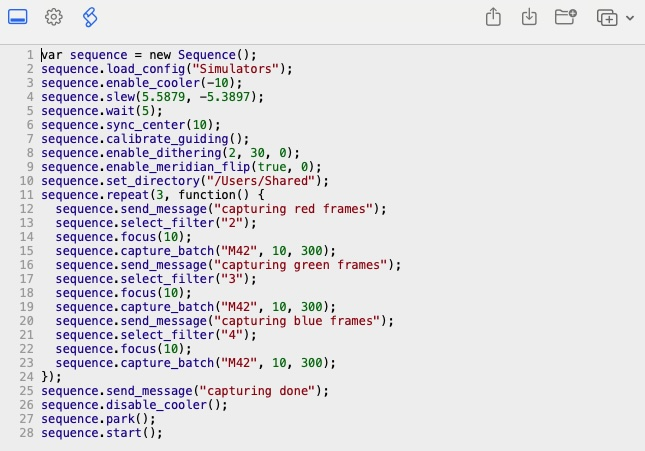
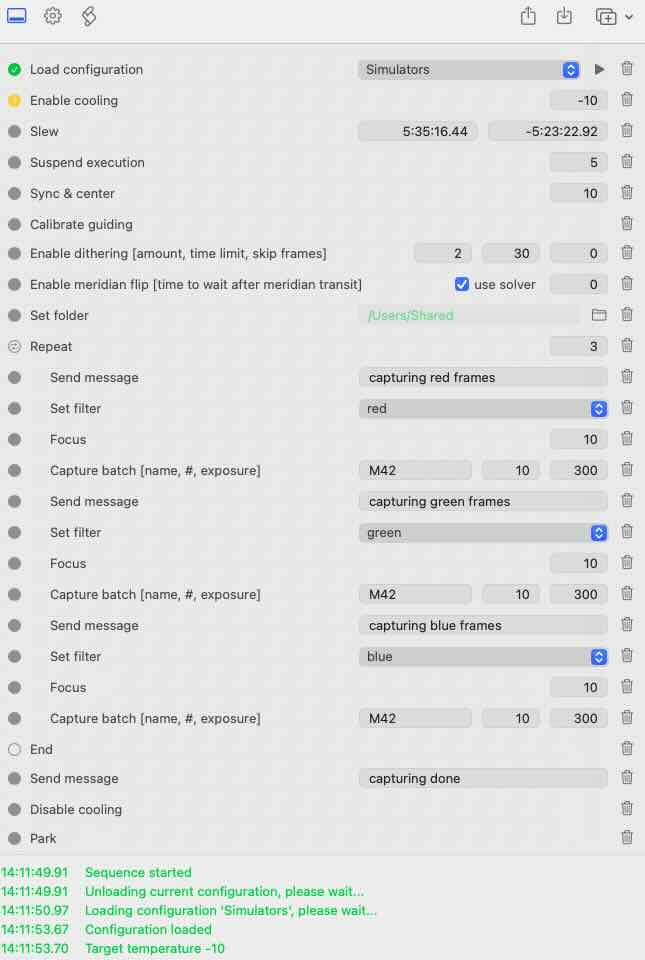

#  INDIGO Script based Sequencer
Revision: 13.07.2026 (draft)

Authors: **Peter Polakovic** & **Rumen G. Bogdanovski**

e-mail: *rumenastro@gmail.com*

## License

INDIGO Astronomy open-source license.

## Overview

The Sequencer is a JavaScript library ([Sequencer.js](Sequencer.js)) executed by the INDIGO **Scripting Agent**. It lets you describe an imaging session - device selection, slewing, focusing, guiding, capturing, meridian flips, etc. - as an ordered list of high level steps and then execute it, while the agent publishes live progress and state as INDIGO properties so a GUI can visualize and control the run.

A sequence is built by creating a `Sequence` object and calling helper methods on it. Each helper call does **not** execute anything immediately - it only appends one (or several) *microsteps* to an internal array. The sequence is executed only when `start()` is called. This two phase design (build, then run) is what allows the GUI to render the whole sequence up front and track which step is currently running.

## Use

Before the first sequence is created, the content of [Sequencer.js](Sequencer.js) must be executed as a script by setting it as the value of `AGENT_SCRIPTING_RUN_SCRIPT_ITEM` in the `AGENT_SCRIPTING_RUN_SCRIPT_PROPERTY` of the Scripting Agent. This defines the `Sequence` class and registers the internal event handlers.

## State: under development

## Quick start

```js
var sequence = new Sequence("M42 LRGB");

sequence.load_config("Simulators");
sequence.enable_cooler(-10);
sequence.slew(5.5879, -5.3897);
sequence.wait(5);
sequence.sync_center(10);

sequence.enable_dithering(2, 30, 0);
sequence.enable_meridian_flip(true, 0);

sequence.calibrate_guiding(0.5);
sequence.start_guiding(1.5);
sequence.set_directory("/Users/Shared");

sequence.send_message("capturing luminance frames");
sequence.select_filter("L");
sequence.focus(10);
sequence.capture_batch("M42", 20, 120);

sequence.send_message("capturing red frames");
sequence.select_filter("R");
sequence.focus(10);
sequence.capture_batch("M42", 10, 300);

sequence.send_message("capturing green frames");
sequence.select_filter("G");
sequence.focus(10);
sequence.capture_batch("M42", 10, 300);

sequence.send_message("capturing blue frames");
sequence.select_filter("B");
sequence.focus(10);
sequence.capture_batch("M42", 10, 300);

sequence.send_message("capturing done");
sequence.stop_guiding();
sequence.disable_cooler();
sequence.park();

sequence.start();
```

## Building a sequence

### Creating the sequence

```js
var sequence = new Sequence("Sequence name");
```

The name is optional; if omitted it defaults to an empty string. It is reported to clients in the `SEQUENCE_NAME` property.

### Adding steps

Call helper methods (documented in [Step reference](#step-reference) below) in the order you want them executed:

```js
sequence.select_filter("R");
sequence.focus(10);
sequence.capture_batch("M42", 10, 300);
```

Remember that calling a helper only records the step - nothing is sent to the hardware until `start()` is called.

### Loops

`repeat(count, block)` records a loop. The `block` is an anonymous function containing the loop body; it is expanded (unrolled) `count` times when the sequence is built, so the GUI shows the full progress. Loops may be nested.

```js
sequence.repeat(3, function() {
	sequence.send_message("capturing red frames");
	sequence.select_filter("R");
	sequence.focus(10);
	sequence.capture_batch("M42", 10, 300);
	sequence.send_message("capturing green frames");
	sequence.select_filter("G");
	sequence.focus(10);
	sequence.capture_batch("M42", 10, 300);
	sequence.send_message("capturing blue frames");
	sequence.select_filter("B");
	sequence.focus(10);
	sequence.capture_batch("M42", 10, 300);
});
```

By default the per-step state of the loop body is reset on each iteration so the GUI reflags the steps as they run again. This can be turned off with `disable_reset_loop_content_state()` (and back on with `enable_reset_loop_content_state()`).

### Executing the sequence

```js
sequence.start();
```

`start(imager_agent, mount_agent, guider_agent)` optionally accepts the device names of the agents to drive. When omitted they default to `"Imager Agent"`, `"Mount Agent"` and `"Guider Agent"` respectively:

```js
sequence.start("Imager Agent @ observatory", "Mount Agent @ observatory", "Guider Agent @ observatory");
```

## Step reference

All methods below are called on a `Sequence` instance and append one or more steps. Times/exposures are in **seconds**, coordinates in the units used by the corresponding agent (RA in hours, Dec in degrees), unless noted otherwise.

### Flow control & timing

| Method | Description |
|---|---|
| `repeat(count, block)` | Repeat the steps recorded by `block` `count` times (see [Loops](#loops)). |
| `wait(delay)` | Pause the sequence for `delay` seconds. |
| `wait_until(time)` | Block until `time`. If `time` is a string it is treated as a UTC time; otherwise as a local time value. Warns once if the wait would exceed 12 hours. |
| `wait_for_gps()` | Block until the selected GPS device has a fix. |
| `break_at(time)` | Checkpoint: when execution reaches it, if `time` has already passed, skip forward to the next `resume_point()`; otherwise continue. `time` is a UTC time string or a local time number. Typically placed inside a loop to stop capturing after a cutoff time. Warns once if `time` is more than 12 hours ahead. |
| `break_at_ha(limit)` | Checkpoint: if the mount's hour angle is past `limit`, skip forward to the next `resume_point()`; otherwise continue. `limit` is a sexagesimal string or a number in hours. |
| `send_message(message)` | Broadcast a human readable message to all clients. |
| `evaluate(code)` | Evaluate an arbitrary snippet of scripting `code` as a step. |
| `enable_verbose()` / `disable_verbose()` | Turn verbose logging of executed steps on/off. |
| `enable_reset_loop_content_state()` / `disable_reset_loop_content_state()` | Control whether loop body step states are reset on each iteration. |

### Failure handling & recovery

By default a failing step aborts the sequence. These steps change that behavior for the steps that follow them:

| Method | Description |
|---|---|
| `abort_on_failure()` | On failure, abort the sequence (the default). |
| `continue_on_failure()` | On failure, log it and continue with the next step. |
| `recover_on_failure()` | On failure, skip **forward** to the next `recovery_point()`, discarding the steps in between. If no recovery point follows the failed step, the sequence ends in the **Alert** state ("no recovery point found"). |
| `recovery_point()` | Mark a point where execution resumes after a failure while `recover_on_failure()` is active. Recovery only ever skips forward, so a recovery point must be placed *after* the steps it is meant to protect. |
| `resume_point()` | Mark a point where execution continues after a `break_at()` / `break_at_ha()` break fires; the steps between the break and this point are skipped. If no resume point follows, the sequence simply finishes ("no resume point found"). |

### Configuration & drivers

| Method | Description |
|---|---|
| `load_config(name)` | Load a saved server configuration by `name`. |
| `load_driver(name)` / `unload_driver(name)` | Load / unload a driver by `name`. |

### Selecting agents & devices

The `select_*_agent` methods pick which agent drives each role; the remaining `select_*` methods pick the concrete device each agent should use.

| Method | Description |
|---|---|
| `select_imager_agent(agent)` | Select the imager agent. |
| `select_mount_agent(agent)` | Select the mount agent. |
| `select_guider_agent(agent)` | Select the guider agent. |
| `select_imager_camera(camera)` | Select the imaging camera. |
| `select_filter_wheel(wheel)` | Select the filter wheel. |
| `select_focuser(focuser)` | Select the focuser. |
| `select_rotator(rotator)` | Select the rotator. |
| `select_mount(mount)` | Select the mount. |
| `select_dome(dome)` | Select the dome. |
| `select_gps(gps)` | Select the GPS device. |
| `select_guider_camera(camera)` | Select the guider camera. |
| `select_guider(guider)` | Select the guiding device (e.g. ST4 / pulse guide output). |

### Camera & exposure setup

| Method | Description |
|---|---|
| `select_frame_type(type)` | Select the frame type (e.g. `"Light"`, `"Dark"`, `"Flat"`, `"Bias"`). |
| `select_image_format(format)` | Select the image format (e.g. `"FITS"`, `"RAW"`, `"XISF"`). |
| `set_frame(left, top, width, height)` | Set a sub-frame (ROI). |
| `reset_frame()` | Reset the frame to full sensor size. |
| `select_camera_mode(mode)` | Select a camera readout/binning mode. |
| `set_gain(value)` | Set camera gain. |
| `set_offset(value)` | Set camera offset. |
| `set_gamma(value)` | Set camera gamma. |
| `enable_cooler(temperature)` | Turn the cooler on and set the target `temperature` (°C). |
| `disable_cooler()` | Turn the cooler off. |

DSLR specific:

| Method | Description |
|---|---|
| `select_program(program)` | Select the DSLR program mode. |
| `select_aperture(aperture)` | Select the DSLR aperture. |
| `select_shutter(shutter)` | Select the DSLR shutter speed. |
| `select_iso(iso)` | Select the DSLR ISO. |

### FITS headers & file naming

| Method | Description |
|---|---|
| `set_fits_header(keyword, value)` | Add or set a custom FITS header `keyword`/`value`. |
| `remove_fits_header(keyword)` | Remove a previously set custom FITS header. |
| `set_directory(directory)` | Set the local directory where captured images are saved. |
| `set_file_template(template)` | Set the file name template for saved images. |
| `set_object_name(name)` | Set the object name used in file naming / headers. |

### Filters

| Method | Description |
|---|---|
| `select_filter(filter)` | Move the filter wheel to the given `filter`. Either the filter **name** (e.g. `"R"`) or the **slot number** (e.g. `"2"`) may be passed. |
| `enable_filter_offsets()` / `disable_filter_offsets()` | Enable/disable automatic application of per-filter focus offsets. |

### Capture

| Method | Description |
|---|---|
| `capture_batch(count, exposure)` | Capture a batch of `count` frames of `exposure` seconds each. |
| `capture_batch(name_template, count, exposure)` | As above, but also set the file name template for this batch. |
| `capture_stream(count, exposure)` | Capture `count` frames in streaming mode, `exposure` seconds each. |
| `capture_stream(name_template, count, exposure)` | As above with a file name template. |
| `start_preview(exposure)` | Start a continuous preview with the given `exposure`. |
| `stop_preview()` | Stop the preview. |

Frames captured by `capture_batch` / `capture_stream` contribute to the `EXPOSURE_TOTAL` estimate reported in the `SEQUENCE_STATE` property.

### Focusing

| Method | Description |
|---|---|
| `set_manual_focuser_mode()` / `set_automatic_focuser_mode()` | Switch the focuser between manual and automatic (autofocus) mode. |
| `focus(exposure)` | Run autofocus using `exposure` second frames. Fails the sequence if focusing fails. |
| `focus_ignore_failure(exposure)` | Same as `focus()` but continues even if focusing fails. |
| `set_focuser_position(position)` | Move the focuser to an absolute `position`. |
| `clear_focuser_selection()` | Clear the focuser star selection. |

### Mount

| Method | Description |
|---|---|
| `slew(ra, dec)` | Slew the mount to the given coordinates (RA in hours, Dec in degrees). |
| `park()` / `unpark()` | Park / unpark the mount. |
| `home()` | Send the mount to its home position. |
| `enable_tracking()` / `disable_tracking()` | Turn sidereal tracking on/off. |

### Plate solving & centering

| Method | Description |
|---|---|
| `sync_center(exposure)` | Plate solve using `exposure` second frames and center the current pointing. |
| `precise_goto(exposure, ra, dec)` | Iteratively slew and plate-solve to precisely reach the target `ra`/`dec`. |

### Guiding

| Method | Description |
|---|---|
| `calibrate_guiding(exposure)` | Calibrate the guider. `exposure` is optional; if given it sets the guider exposure first. |
| `start_guiding(exposure)` | Start guiding. `exposure` is optional (sets the guider exposure first if given). |
| `stop_guiding()` | Stop guiding. |
| `clear_guider_selection()` | Clear the guide star selection. |

> `calibrate_guiding_exposure(exposure)` and `start_guiding_exposure(exposure)` are **deprecated** - use `calibrate_guiding(exposure)` / `start_guiding(exposure)` instead.

### Dithering

| Method | Description |
|---|---|
| `enable_dithering(amount, time_limit, skip_frames)` | Enable dithering: `amount` in pixels, `time_limit` seconds to wait for settling, `skip_frames` frames to skip between dithers. |
| `disable_dithering()` | Disable dithering. |

### Meridian flip

| Method | Description |
|---|---|
| `enable_meridian_flip(use_solver, time)` | Enable automatic meridian flip. `use_solver` (boolean) selects whether plate solving is used to recenter after the flip; `time` is the pause after transit in seconds. |
| `disable_meridian_flip()` | Disable automatic meridian flip. |

### Rotator

| Method | Description |
|---|---|
| `set_rotator_angle(value)` | Rotate the field rotator to the given angle. |

## Properties published during execution

Once `start()` is called, the sequencer defines the following properties on the **Scripting Agent** device. A GUI reads them to visualize progress and can write to the read-write ones to control the run.

| Property | Type / Perm | Items | Purpose |
|---|---|---|---|
| `SEQUENCE_NAME` | Text, RO | `NAME` | Name of the currently executed sequence (from the `Sequence` constructor), or empty if none/unset. |
| `SEQUENCE_STATE` | Number, RO | `STEP`, `PROGRESS`, `PROGRESS_TOTAL`, `EXPOSURE`, `EXPOSURE_TOTAL` | Overall execution state (see below). |
| `SEQUENCE_STEP_STATE` | Light, RO | one item per step | Per-step state, letting the GUI flag each step as idle / busy / ok / alert individually. |
| `LOOP_x` | Number, RO | `STEP`, `COUNT` | One property per currently executing loop, where `x` is the zero-based nesting level. `STEP` is the index of the loop command, `COUNT` the number of completed iterations. |
| `AGENT_ABORT_PROCESS` | Switch, RW | `ABORT` | Setting `ABORT` aborts the running sequence. |
| `AGENT_PAUSE_PROCESS` | Switch, RW | `PAUSE_WAIT` | Pause the sequence before the next operation. |
| `SEQUENCE_RESET` | Switch, RW | `RESET` | Reset the state of `SEQUENCE_STATE` (e.g. while the sequence is being edited in the GUI). |
| `FLIPPER_STATE` | Switch, RO | `WAITING_FOR_TRANSIT`, `WAITING_FOR_SLEW`, `WAITING_FOR_SYNC_AND_CENTER`, `WAITING_FOR_GUIDING`, `WAITING_FOR_SETTLE_DOWN`, `RESUME_GUIDING`, `USE_SOLVER` | Progress of an in-progress automatic meridian flip. |

### Interpreting `SEQUENCE_STATE`

- `STEP` - zero-based index of the currently executing step. On failure (property in **Alert** state) it holds the index of the failed step.
- `PROGRESS` / `PROGRESS_TOTAL` - number of executed microsteps and total number of microsteps in the sequence (with loops unrolled). A single helper call can expand to several microsteps.
- `EXPOSURE` / `EXPOSURE_TOTAL` - elapsed and total exposure time (seconds) across all `capture_batch()` / `capture_stream()` steps.
- Property **state** reflects the sequence: **Ok** = finished, **Busy** = executing, **Alert** = failed.

A GUI can use `STEP` together with the property state to flag steps: those with index `< STEP` as done, those with index `> STEP` as idle, and the one equal to `STEP` as either executing (Busy) or failed (Alert). `SEQUENCE_STEP_STATE` provides the same information per step directly.

## Internal implementation

Besides the public `Sequence` class, [Sequencer.js](Sequencer.js) contains two internal singletons that users normally do not call directly:

- `indigo_sequencer` - the execution engine. It interprets the recorded microsteps one by one, waits for the relevant agent properties to reach the expected state, updates the progress properties, and handles abort/pause/failure logic.
- `indigo_flipper` - the meridian-flip state machine driven by `enable_meridian_flip()`. It waits for transit, performs the slew, optionally syncs & centers with the astrometry agent, resumes guiding, waits for settle-down, and reports progress via `FLIPPER_STATE`.

These are wired into the agent through `indigo_event_handlers` and respond to `on_update` / `on_enumerate_properties` events. Refer to [Sequencer.js](Sequencer.js) for the details.

## Examples of visual representation of a sequence in GUI (pre-release of INDIGO A1v5)

 

 
