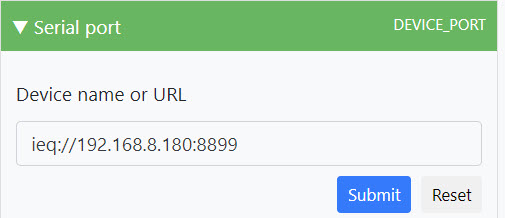
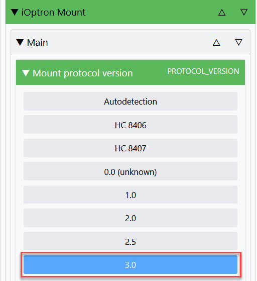

# iOptron mount driver

## Supported devices

iOptron ZEQ25, iEQ30, iEQ45, SmartEQ, GEM28, HEM27, CEM25, CEM60, CEM60-CE or iEQ45 Pro mount connected over serial port or network.

Single device is present on the first startup (no hot-plug support). Additional devices can be configured on runtime.

## Supported platforms

This driver is platform independent

## License

INDIGO Astronomy open-source license.

## Use

indigo_server indigo_mount_ioptron

## Comments

Use URL in form ieq://host:port to connect to the mount over network. The default port can be found through the hand controller going to Settings < Wi-Fi Options < Wireless Status

**EXAMPLE OF SETTING IN INDIGO**

Also make sure you are using the proper protocol version. Example the HEM27 needs to use PROTOCOL_VERSION 3.0

## Status: Stable

Driver is tested with:
* CEM60-EC | Default Port 4030
* iEQ 45 Pro | Default Port 4030
* HEM27 | Default Port 8899